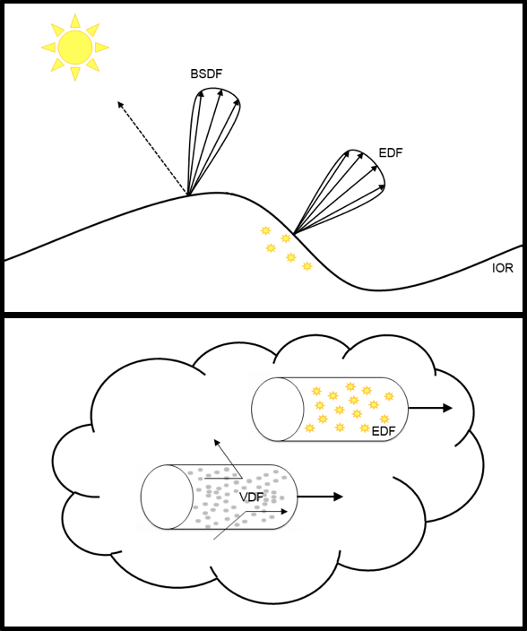

<!-----
MaterialX 基于物理的着色节点 v1.39
----->

- [English](../../../docs_en/documents/Specification/MaterialX.PBRSpec.md)
- [简体中文](MaterialX.PBRSpec.md)

# MaterialX 基于物理的着色节点

**版本 1.39**  
Niklas Harrysson - Lumiere Software  
Doug Smythe - Industrial Light & Magic  
Jonathan Stone - Lucasfilm Advanced Development Group  
2025年12月22日

# 简介

[MaterialX 规范](./MaterialX.Specification.md)描述了许多标准节点，这些节点可用于构建节点图以处理图像、过程生成的值、坐标和其他数据。通过添加用户定义的自定义节点，可以使用节点图描述完整的渲染着色器。到目前为止，这些节点图着色器中使用的特定着色器语义节点尚未标准化，尽管随着向基于物理的着色的广泛转变，行业似乎正在确定一些具有标准化参数和功能的特定 BSDF 和其他函数。

本文档描述了许多实现广泛使用的表面散射、发射和体积分布函数的着色器语义节点，以及用于使用节点图构建复杂分层渲染着色器的实用节点。这些节点与其他节点结合使用可以与 [MaterialX 着色器生成](../DeveloperGuide/ShaderGeneration.md)系统一起使用。

## 目录

**[物理材质模型](#physical-material-model)**  
 [范围](#scope)  
 [物理合理材质](#physically-plausible-materials)  
 [量和单位](#quantities-and-units)  
 [色彩管理](#color-management)  
 [表面](#surfaces)  
  [分层](#layering)  
  [凹凸和法线贴图](#bump-and-normal-mapping)  
  [表面厚度](#surface-thickness)  
 [体积](#volumes)  
 [灯光](#lights)  

**[MaterialX PBS 库](#materialx-pbs-library)**  
 [数据类型](#data-types)  
 [BSDF 节点](#bsdf-nodes)  
 [EDF 节点](#edf-nodes)  
 [VDF 节点](#vdf-nodes)  
 [PBR 着色器节点](#pbr-shader-nodes)  
 [实用节点](#utility-nodes)  

**[着色模型示例](#shading-model-examples)**  
 [Autodesk Standard Surface](#autodesk-standard-surface)  
 [UsdPreviewSurface](#usdpreviewsurface)  
 [Khronos glTF PBR](#khronos-gltf-pbr)  
 [OpenPBR Surface](#openpbr-surface)

**[参考文献](#references)**

 

# 物理材质模型

本节描述了 MaterialX 基于物理的着色(PBS)库中使用的材质模型，以及我们必须遵循的物理合理规则。

## 范围

材质描述了表面或介质的属性，涉及其对光的反应方式。为了提高效率，材质模型被分为不同的部分，每个部分处理特定类型的光交互:在表面散射的光、从表面发射的光、在介质内部散射的光等。我们的材质模型定义的目标是描述物理合理渲染系统中典型的光-材质交互，包括那些在故事片制作、实时预览和游戏引擎中的系统。

我们的模型支持表面材质，包括从物体表面散射和发射光，以及体积材质，包括在参与介质内散射和发射光。对于照明，我们支持局部灯光和来自环境的光源。几何修改以凹凸和法线贴图以及位移贴图的形式支持。

## 物理合理材质

物理合理材质的初始要求是:1) 应该是能量守恒的，2) 支持互易性。能量守恒表示从表面离开反射和透射光的总和必须小于或等于到达它的光量。互易性要求说，如果传播光的方向反转，材质的响应保持不变。也就是说，如果入射和出射方向交换，响应是相同的。为 ShaderGen 实现的所有材质都应尊重这些要求，只有在出于艺术自由目的有意义的极少数情况下才会偏离它。

## 量和单位

辐射度量用于材质模型与渲染器的交互。基本辐射度量是**辐射度**（测量单位为 _Wm−2sr−1_），给出在给定方向上到达或离开给定点的光强度。如果将所有方向的入射辐射度积分，我们得到**辐照度**（测量单位为 _Wm−2_），如果我们将此在表面积上积分，我们得到**功率**（测量单位为 _W_）。以光度单位指定的材质和灯光输入参数可以在提交给渲染器之前适当地转换为其辐射度量对应物。

表面和体积着色器返回的数据类型的解释未指定，留给渲染器和该渲染器的着色器生成器决定。对于 OpenGL 类型的渲染器，它们将是包含由着色器节点直接计算的辐射度的浮点元组，但对于 OSL 类型的渲染器，它们可能是由渲染器在光传输模拟中使用的闭包基元。

通常，提供给渲染器的颜色被认为代表线性 RGB 色彩空间。然而，没有什么阻止渲染器以不同方式解释颜色类型，例如保存光谱值。在这种情况下，该渲染器的着色器生成器需要在涉及颜色类型的节点实现中处理这个问题。

## 色彩管理

MaterialX 支持使用[色彩管理系统](./MaterialX.Specification.md#color-spaces-and-color-management-systems)将颜色与特定色彩空间关联。MaterialX 文档通常指定要用于文档的工作色彩空间以及输入值和纹理所在的色彩空间。如果这些色彩空间与工作色彩空间不同，应用程序和着色器生成器有责任转换它们。

ShaderGen 模块有一个接口，可用于集成对不同色彩管理系统的支持。提供了一个简化的实现，其中包含一些流行且常用的颜色转换，并默认启用。计划将来与 OpenColorIO ([http://opencolorio.org](http://opencolorio.org) 的相关部分集成。

## 表面

在我们的表面着色模型中，光的散射和发射由分布函数控制。入射光可以从表面反射、透射或被吸收。这由双向散射分布函数(BSDF)表示。光也可以从表面发射，例如从光源或发光材质。这由发射分布函数(EDF)表示。PBS 库引入了数据类型 `BSDF` 和 `EDF` 来表示分布函数，并且有节点用于构建、组合和操作它们。

另一个重要属性是 **折射率**（IOR），它描述了光如何在介质中传播。它控制光线穿过两种不同折射率介质之间的界面时光线弯曲的程度。它还决定了到达界面时反射和透射的光量，如 Fresnel 方程所述。

表面着色器用数据类型 `surfaceshader` 表示。在 PBS 库中，有一个 [&lt;surface>](#node-surface) 节点从 BSDF 和 EDF 构建表面着色器。由于有节点可以组合和修改它们，您可以轻松地从不同的分布函数组合构建表面着色器。分布函数节点上的输入可以连接，标准库中的节点可以组合成复杂的计算，为艺术家提供了在表面上创建设计材质变体的灵活性。

着色模型通常区分封闭表面和薄壁表面。封闭表面表示具有固体内部的封闭水密接口。典型的例子是实心玻璃物体。另一方面，薄壁表面具有无限薄的体积，如一张纸或肥皂泡。对于封闭表面，如果材质不透明，则没有背面可见。在透明封闭表面的情况下，背面命中被视为光退出封闭接口。对于薄壁表面，正面和背面都可见，并且可以在两侧具有相同的材质或在每侧具有不同的材质。如果在这种情况下材质是透明的，薄壁使光透射而不发生折射或散射。默认情况下，[&lt;surface>](#node-surface) 节点为封闭表面构建表面着色器，但有一个布尔开关使其成为薄壁。

为了将不同的着色器分配给薄壁物体的每一侧，标准库中的 [&lt;surfacematerial>](./MaterialX.Specification.md#node-surfacematerial) 节点有一个输入来连接额外的背面表面着色器。如果 &lt;surfacematerial> 的任何一侧连接了薄壁着色器，则两侧都被视为薄壁。因此，薄壁属性优先以避免两侧之间的歧义。如果只有一侧有着色器连接，则用于两侧。如果两侧都连接但没有任何着色器是薄壁的，则使用前着色器。在混合表面着色器的情况下，薄壁属性也优先。如果混合中涉及的任何着色器是薄壁的，则两个着色器都被视为薄壁。

请注意，为了使两侧都设置表面着色器，几何体必须设置为双面。几何体侧面性是一个不由 MaterialX 处理的属性，需要在其他地方设置。

### 分层

为了简化复杂材质的设计，我们的模型支持分层的概念。典型示例包括:在汽车油漆材质上添加一层清漆，或在金属表面上放置一层污垢或锈迹。分层可以通过多种不同的方式完成:

* 水平分层:一种简单的分层方式是使用每个着色点的不同 BSDF 的线性混合，其中每个 BSDF 给出一个混合因子来控制其贡献。由于权重是按着色点计算的，它可以用作遮罩来隐藏表面不同部分的贡献。权重也可以根据视角计算以模拟近似 Fresnel 行为。这种类型的分层可以在 BSDF 级别和表面着色器级别完成。后者对于混合内部包含许多 BSDF 的完整着色器很有用，例如将污垢放在汽车油漆上、油脂放在生锈的金属上或将贴花添加到塑料表面。我们将这种类型的分层称为**水平分层**，PBS 库中的 [&lt;mix>](#node-mix) 节点可用于实现此目的（见下文）。
* 垂直分层:还支持一种更符合物理的分层形式，其中顶部 BSDF 层放置在另一个基础 BSDF 层之上，并且未被顶层反射的光被假定透射到基础层；例如，在基板上添加介电涂层。涂层的折射率和粗糙度然后将影响到达基板的光的衰减。基板可以是透射 BSDF 以进一步透射光，或者反射 BSDF 以将光反射回通过涂层。基板又可以是反射 BSDF 以模拟多个镜面波瓣。我们将这种类型的分层称为**垂直分层**，可以使用 PBS 库中的 [&lt;layer>](#node-layer) 节点实现。参见下面的 [&lt;dielectric_bsdf>](#node-dielectric-bsdf) 和 [&lt;sheen_bsdf>](#node-sheen-bsdf)。
* 着色器输入混合:计算和混合许多 BSDF 或单独的表面着色器可能很昂贵。在某些情况下，在任何照明计算之前混合纹理/值输入可以实现良好的结果。通常，人们会将此与可以模拟许多不同材质的 über-shader 一起使用，并通过在其表面上遮罩或混合其输入，您将获得具有多层的 appearance，但具有更便宜的纹理或值混合。这在主 [MaterialX 规范 "着色前合成示例"](./MaterialX.Specification.md#example-pre-shader-compositing-material) 中给出了示例。

### 凹凸和法线贴图

用于着色计算的表面法线作为输入提供给需要它的每个 BSDF。在将其提供给 BSDF 之前，法线可以通过凹凸或法线贴图扰动。因此，可以为同一着色点的不同 BSDF 提供不同的法线。当分层 BSDF 时，每层可以使用不同的凹凸和法线贴图。

## 体积

在我们的体积着色器模型中，参与介质中光的散射由体积分布函数(VDF)控制，系数控制吸收和散射的速率。VDF 代表物理学家所称的_相位函数_，描述光在介质中散射时如何从其当前方向分布。这类似于 BSDF 如何描述表面的散射，但有一个重要区别:VDF 是归一化的，如果考虑所有方向，总和为 1.0。此外，吸收和散射的量由系数控制，该系数给出在世界空间中行进距离的速率（概率）。**吸收系数**设置光穿过介质时的吸收速率，**散射系数**设置光从其当前方向散射的速率。这些的单位是 _m−1_。

光也可以从体积发射。这由类似于表面发射的 EDF 表示，但在这种情况下，发射以每距离穿过介质的辐射度给出。其单位是 _Wm−3sr−1_。发射分布沿当前方向定向。

PBS 库中的 [&lt;volume>](#node-volume) 节点从单独的 VDF 和 EDF 组件构建体积着色器。还有节点用于构建各种 VDF，以及节点用于组合它们以构建更复杂的 VDF。

VDF 也可用于描述表面的内部。典型的例子是模拟光在透过有色玻璃或浑浊水时如何被吸收或散射。这是通过使用 [&lt;layer>](#node-layer) 节点将用于表面透射的 BSDF 分层在 VDF 之上来完成的。

## 灯光

光源可以分为环境灯光和局部灯光。环境灯光表示来自无限远处的贡献。所有其他灯光都是局部灯光，在空间中具有位置和范围。

局部灯光指定为分配给定位器的灯光着色器，建模显式光源，或使用发射表面着色器以发射几何体的形式。PBS 库中的 [&lt;light>](#node-light) 节点从 EDF 构建灯光着色器。还有节点用于构建各种 EDF，以及节点用于组合它们以构建更复杂的 EDF。表面着色器的发射属性也使用 EDF 建模；有关更多信息，请参见下面的 [**EDF 节点**](#edf-nodes) 部分。

来自远处的光贡献由环境灯光处理。这些通常是摄影捕捉或过程生成的图像，围绕整个场景。这类灯光还包括像太阳这样的光源，其中长距离传播使光本质上是方向性的且没有衰减。对于所有着色点，环境被视为无限远。

 

# MaterialX PBS 库

MaterialX 包含一个用于创建上述物理合理材质和灯光的类型和节点库。本节概述了该库的内容。

## 数据类型

* `BSDF`： 表示双向散射分布函数的数据类型。
* `EDF`： 表示发射分布函数的数据类型。
* `VDF`： 表示体积分布函数的数据类型。

PBS 节点还使用以下标准 MaterialX 类型:

* `surfaceshader`： 表示表面着色器的数据类型。
* `lightshader`： 表示灯光着色器的数据类型。
* `volumeshader`： 表示体积着色器的数据类型。
* `displacementshader`： 表示位移着色器的数据类型。

## BSDF 节点

### `oren_nayar_diffuse_bsdf`
基于 Oren-Nayar 反射模型构建漫反射 BSDF。

`roughness` 为 0.0 时给出 Lambertian 反射。

`energy_compensation` 布尔值在 Qualitative Oren-Nayar[^Oren1994] 和 Energy-Preserving Oren-Nayar[^Portsmouth2025] 漫反射模型之间选择。

|端口                 |描述                            |类型   |默认值         |可接受的值|
|---------------------|-------------------------------|-------|----------------|---------------|
|`weight`             |BSDF 贡献的权重        |float  |1.0             |[0, 1]         |
|`color`              |漫反射率或反照率         |color3 |0.18, 0.18, 0.18|               |
|`roughness`          |表面粗糙度                      |float  |0.0             |[0, 1]         |
|`normal`             |表面的法线向量           |vector3|Nworld          |               |
|`energy_compensation`|为 BSDF 启用能量补偿|boolean|false           |               |
|`out`                |输出:计算的 BSDF              |BSDF   |                |               |

### `burley_diffuse_bsdf`
基于 Disney Principled 模型的相应组件构建漫反射 BSDF[^Burley2012]。

|端口       |描述                    |类型    |默认值         |可接受的值|
|-----------|-----------------------|--------|----------------|---------------|
|`weight`   |BSDF 贡献的权重|float   |1.0             |[0, 1]         |
|`color`    |漫反射率或反照率 |color3  |0.18, 0.18, 0.18|               |
|`roughness`|表面粗糙度              |float   |0.0             |[0, 1]         |
|`normal`   |表面的法线向量   |vector3 |Nworld          |               |
|`out`      |输出:计算的 BSDF      |BSDF    |                |               |

### `dielectric_bsdf`
基于微面反射模型和介电质的 Fresnel 曲线构建反射和/或透射 BSDF[^Walter2007]。如果启用了反射散射，节点可以垂直分层在介电层下方表面的基础 BSDF 之上。通过链接多个 &lt;dielectric_bsdf> 节点，您可以描述具有多个镜面波瓣的表面。如果启用了透射散射，节点可以分层在描述表面内部的 VDF 之上，以处理介质内部的吸收和散射，适用于有色玻璃、浑浊水等。

实现应在表面粗糙度增加时保持能量守恒，多重散射补偿[^Turquin2019]是一种流行的实现策略。

`tint` 输入为反射和透射光着色，但为了物理正确的结果应保留为白色 (1, 1, 1)。将 `ior` 输入设置为零会禁用 Fresnel 曲线，允许仅通过 weight 和 tint 控制反射率。

将 `retroreflective` 设置为 true 会将 BSDF 切换到逆反射模式，其中光被反射回入射方向而不是镜面反射方向[^Raab2025]。

可以通过将 `thinfilm_thickness` 设置为非零值来启用薄膜虹彩效果[^Belcour2017]。

`scatter_mode` 控制表面是反射光 (`R`)、透射光 (`T`) 还是两者 (`RT`)。在 `RT` 模式下，进入和离开表面时都会发生反射和透射，其各自的强度由 Fresnel 曲线控制。根据 IOR 和入射角，即使选择了透射模式也可能发生全内反射。

|端口                |描述                                                    |类型   |默认值      |可接受的值|
|--------------------|-------------------------------------------------------|-------|-------------|---------------|
|`weight`            |BSDF 贡献的权重                                |float  |1.0          |[0, 1]         |
|`tint`              |为反射和透射光着色的颜色权重       |color3 |1.0, 1.0, 1.0|               |
|`ior`               |表面的折射率                             |float  |1.5          |               |
|`roughness`         |沿切线和副切线的表面粗糙度              |vector2|0.05, 0.05   |[0, 1]         |
|`retroreflective`   |为 BSDF 启用逆反射模式                       |boolean|false        |               |
|`thinfilm_thickness`|虹彩薄膜层的厚度（纳米）      |float  |0.0          |               |
|`thinfilm_ior`      |薄膜层的折射率                     |float  |1.5          |               |
|`normal`            |表面的法线向量                                   |vector3|Nworld       |               |
|`tangent`           |表面的切线向量                                  |vector3|Tworld       |               |
|`distribution`      |微面分布类型                                   |string |ggx          |ggx            |
|`scatter_mode`      |表面散射模式，指定反射和/或透射|string |R            |R, T, RT       |
|`out`               |输出:计算的 BSDF                                      |BSDF   |             |               |

### `conductor_bsdf`
基于微面反射模型构建反射 BSDF[^Burley2012]。使用具有复数折射率的 Fresnel 曲线用于导体/金属。如果需要艺术化参数化[^Gulbrandsen2014]，可以连接 [&lt;artistic_ior>](#node-artistic-ior) 实用节点来处理。

实现应在表面粗糙度增加时保持能量守恒，多重散射补偿[^Turquin2019]是一种流行的实现策略。

`ior` 和 `extinction` 的默认值代表金的近似值。

将 `retroreflective` 设置为 true 会将 BSDF 切换到逆反射模式，其中光被反射回入射方向而不是镜面反射方向[^Raab2025]。

可以通过将 `thinfilm_thickness` 设置为非零值来启用薄膜虹彩效果[^Belcour2017]。

|端口                |描述                                              |类型   |默认值               |可接受的值|
|--------------------|-------------------------------------------------|-------|----------------------|---------------|
|`weight`            |BSDF 贡献的权重                          |float  |1.0                   |[0, 1]         |
|`ior`               |折射率                                      |color3 |0.183, 0.421, 1.373   |               |
|`extinction`        |消光系数                                   |color3 |3.424, 2.346, 1.770   |               |
|`roughness`         |表面粗糙度                                        |vector2|0.05, 0.05            |[0, 1]         |
|`retroreflective`   |为 BSDF 启用逆反射模式                 |boolean|false                 |               |
|`thinfilm_thickness`|虹彩薄膜层的厚度（纳米）|float  |0.0                   |               |
|`thinfilm_ior`      |薄膜层的折射率               |float  |1.5                   |               |
|`normal`            |表面的法线向量                             |vector3|Nworld                |               |
|`tangent`           |表面的切线向量                            |vector3|Tworld                |               |
|`distribution`      |微面分布类型                             |string |ggx                   |ggx            |
|`out`               |输出:计算的 BSDF                                |BSDF   |                      |               |

### `generalized_schlick_bsdf`
基于微面模型和广义 Schlick Fresnel 曲线构建反射和/或透射 BSDF[^Hoffman2023]。如果启用了反射散射，节点可以垂直分层在介电层下方表面的基础 BSDF 之上。通过链接多个 &lt;generalized_schlick_bsdf> 节点，您可以描述具有多个镜面波瓣的表面。如果启用了透射散射，节点可以分层在描述表面内部的 VDF 之上，以处理介质内部的吸收和散射，适用于有色玻璃、浑浊水等。

实现应在表面粗糙度增加时保持能量守恒，多重散射补偿[^Turquin2019]是一种流行的实现策略。

`color82` 输入提供 82 度时反射率的乘数，用于捕获金属表面反射率曲线中特征的“下降”。将其设置为 (1, 1, 1) 实际上会禁用此功能以保持向后兼容性。

将 `retroreflective` 设置为 true 会将 BSDF 切换到逆反射模式，其中光被反射回入射方向而不是镜面反射方向[^Raab2025]。

可以通过将 `thinfilm_thickness` 设置为非零值来启用薄膜虹彩效果[^Belcour2017]。

`scatter_mode` 行为与 `dielectric_bsdf` 匹配:在 `RT` 模式下，进入和离开表面时都会发生反射和透射，强度由 Fresnel 曲线控制。根据入射角可能发生全内反射。

|端口                |描述                                                    |类型   |默认值      |可接受的值|
|--------------------|-------------------------------------------------------|-------|-------------|---------------|
|`weight`            |BSDF 贡献的权重                                |float  |1.0          |[0, 1]         |
|`color0`            |正面角度时每个颜色分量的反射率              |color3 |1.0, 1.0, 1.0|               |
|`color82`           |82 度时的反射率乘数                          |color3 |1.0, 1.0, 1.0|               |
|`color90`           |掠射角度时每个颜色分量的反射率             |color3 |1.0, 1.0, 1.0|               |
|`exponent`          |color0 和 color90 之间 Schlick 混合的指数       |float  |5.0          |               |
|`roughness`         |沿切线和副切线的表面粗糙度              |vector2|0.05, 0.05   |[0, 1]         |
|`retroreflective`   |为 BSDF 启用逆反射模式                       |boolean|false        |               |
|`thinfilm_thickness`|虹彩薄膜层的厚度（纳米）      |float  |0.0          |               |
|`thinfilm_ior`      |薄膜层的折射率                     |float  |1.5          |               |
|`normal`            |表面的法线向量                                   |vector3|Nworld       |               |
|`tangent`           |表面的切线向量                                  |vector3|Tworld       |               |
|`distribution`      |微面分布类型                                   |string |ggx          |ggx            |
|`scatter_mode`      |表面散射模式，指定反射和/或透射|string |R            |R, T, RT       |
|`out`               |输出:计算的 BSDF                                      |BSDF   |             |               |

### `translucent_bsdf`
基于 Lambert 反射模型构建半透明（漫透射）BSDF。

|端口     |描述                    |类型   |默认值      |可接受的值|
|---------|-----------------------|-------|-------------|---------------|
|`weight` |BSDF 贡献的权重|float  |1.0          |[0, 1]         |
|`color`  |漫透射率          |color3 |1.0, 1.0, 1.0|               |
|`normal` |表面的法线向量   |vector3|Nworld       |               |
|`out`    |输出:计算的 BSDF      |BSDF   |             |               |

### `subsurface_bsdf`
为均匀介质内的次表面散射构建次表面散射 BSDF。参数化选择为匹配随机游走 Monte Carlo 方法以及近似经验方法[^Christensen2015]。请注意，此类次表面散射可以更严格地定义为垂直分层在 [<anisotropic_vdf>](#node-anisotropic-vdf) 之上的 BSDF，我们期望这两种散射-表面分布函数的描述在 MaterialX 的未来版本中统一。

`radius` 输入设置光在表面下传播然后散射回来的平均距离（平均自由程），可以为每个颜色通道独立设置。

`anisotropy` 输入控制散射方向:负值产生向后散射，正值产生向前散射，零产生均匀散射。

|端口        |描述                               |类型   |默认值         |可接受的值|
|------------|----------------------------------|-------|----------------|---------------|
|`weight`    |BSDF 贡献的权重           |float  |1.0             |[0, 1]         |
|`color`     |漫反射率（反照率）             |color3 |0.18, 0.18, 0.18|               |
|`radius`    |每个颜色通道的平均自由程          |color3 |1.0, 1.0, 1.0   |               |
|`anisotropy`|散射方向的各向异性因子|float  |0.0             |[-1, 1]        |
|`normal`    |表面的法线向量              |vector3|Nworld          |               |
|`out`       |输出:计算的 BSDF                 |BSDF   |                |               |

### `sheen_bsdf`
为类布料材质的后向散射属性构建微面 BSDF。此节点可以使用 [&lt;layer>](#node-layer) 节点垂直分层在基础 BSDF 之上。所有未反射的能量将传输到基础层。`mode` 选项在两种可用的 sheen 模型之间选择，Conty-Kulla[^Conty2017] 和 Zeltner[^Zeltner2022]。

|端口       |描述                                             |类型   |默认值      |可接受的值     |
|-----------|------------------------------------------------|-------|-------------|--------------------|
|`weight`   |BSDF 贡献的权重                         |float  |1.0          |[0, 1]              |
|`color`    |Sheen 反射率                                      |color3 |1.0, 1.0, 1.0|                    |
|`roughness`|表面粗糙度                                       |float  |0.3          |                    |
|`normal`   |表面的法线向量                            |vector3|Nworld       |                    |
|`mode`     |在 `conty_kulla` 和 `zeltner` sheen 模型之间选择|string |conty_kulla  |conty_kulla, zeltner|
|`out`      |输出:计算的 BSDF                               |BSDF   |             |                    |

### `chiang_hair_bsdf`
基于 Chiang 头发着色模型构建头发 BSDF[^Chiang2016]。此节点不支持垂直分层。

粗糙度输入控制每个波瓣的纵向 (ν) 和方位角 (s) 粗糙度，(0, 0)指定纯镜面散射。默认 `ior` 1.55 代表角蛋白的折射率。`cuticle_angle` 以弧度为单位，0.5 表示无倾斜，高于 0.5 的值使鳞片向纤维根部倾斜。

|端口                    |描述                                             |类型   |默认值      |可接受的值|
|------------------------|------------------------------------------------|-------|-------------|---------------|
|`tint_R`                |第一个 R 波瓣的颜色乘数                   |color3 |1.0, 1.0, 1.0|               |
|`tint_TT`               |第一个 TT 波瓣的颜色乘数                  |color3 |1.0, 1.0, 1.0|               |
|`tint_TRT`              |第一个 TRT 波瓣的颜色乘数                 |color3 |1.0, 1.0, 1.0|               |
|`ior`                   |折射率                                     |float  |1.55         |               |
|`roughness_R`           |R 波瓣的纵向和方位角粗糙度         |vector2|0.1, 0.1     |[0, ∞)         |
|`roughness_TT`          |TT 波瓣的纵向和方位角粗糙度        |vector2|0.05, 0.05   |[0, ∞)         |
|`roughness_TRT`         |TRT 波瓣的纵向和方位角粗糙度       |vector2|0.2, 0.2     |[0, ∞)         |
|`cuticle_angle`         |角质层角度（弧度）                                |float  |0.5          |[0, 1]         |
|`absorption_coefficient`|归一化到头发纤维直径的吸收系数|vector3|0.0, 0.0, 0.0|               |
|`normal`                |表面的法线向量                            |vector3|Nworld       |               |
|`curve_direction`       |头发几何体的方向                          |vector3|Tworld       |               |
|`out`                   |输出:计算的 BSDF                               |BSDF   |             |               |

## EDF 节点

### `uniform_edf`
构建在所有方向上均匀发射光的 EDF。

|端口    |描述                       |类型   |默认值      |
|--------|--------------------------|-------|-------------|
|`color` |从表面离开的光的辐射出射度  |color3 |1.0, 1.0, 1.0|
|`out`   |输出:计算的 EDF            |EDF    |             |

### `conical_edf`
构建在法线方向周围的圆锥内发射光的 EDF。

光强度在 `inner_angle` 开始衰减，在 `outer_angle` 降至零（均以度为单位）。如果 `outer_angle` 小于 `inner_angle`，则圆锥内不发生衰减。

|端口         |描述                      |类型   |默认值      |
|-------------|--------------------------|-------|-------------|
|`color`      |从表面离开的光的辐射出射度  |color3 |1.0, 1.0, 1.0|
|`normal`     |表面的法线向量              |vector3|Nworld       |
|`inner_angle`|强度衰减开始的内锥角度      |float  |60.0         |
|`outer_angle`|强度降至零的外锥角度        |float  |0.0          |
|`out`        |输出:计算的 EDF             |EDF    |             |

### `measured_edf`
根据测量的 IES 灯光配置文件构建发射光的 EDF。

|端口    |描述                         |类型    |默认值      |
|--------|----------------------------|--------|-------------|
|`color` |从表面离开的光的辐射出射度    |color3  |1.0, 1.0, 1.0|
|`normal`|表面的法线向量                |vector3 |Nworld       |
|`file`  |包含 IES 灯光配置文件数据的路径|filename|__empty__    |
|`out`   |输出:计算的 EDF               |EDF     |             |

### `generalized_schlick_edf`
为 EDF 添加方向变化因子。根据广义 Schlick Fresnel 曲线缩放基础 EDF 的发射分布。

|端口      |描述                                      |类型  |默认值      |
|----------|------------------------------------------|------|-------------|
|`color0`  |正面角度的发射度缩放因子                    |color3|1.0, 1.0, 1.0|
|`color90` |掠射角度的发射度缩放因子                    |color3|1.0, 1.0, 1.0|
|`exponent`|color0 和 color90 之间 Schlick 混合的指数  |float |5.0          |
|`base`    |要修改的基础 EDF                           |EDF   |__zero__     |
|`out`     |输出:计算的 EDF                            |EDF   |             |

## VDF 节点

### `absorption_vdf`
构建纯光吸收的 VDF。

`absorption` 输入表示介质中每行进距离的吸收率，单位为 _m−1_，每个波长独立控制。

|端口        |描述           |类型   |默认值      |
|------------|--------------|-------|-------------|
|`absorption`|介质的吸收率    |vector3|0.0, 0.0, 0.0|
|`out`       |输出:计算的 VDF|VDF    |             |

### `anisotropic_vdf`
基于 Henyey-Greenstein 相位函数[^Pharr2023]构建散射参与介质光的 VDF。支持向前、向后和均匀散射，由各向异性输入控制。

`absorption` 输入表示介质中每行进距离的吸收率，单位为 _m−1_，每个波长独立控制。

`anisotropy` 输入控制散射方向:负值产生向后散射，正值产生向前散射，0.0 产生均匀散射。吸收率和散射率均按波长指定。

|端口        |描述                   |类型   |默认值      |可接受的值|
|------------|----------------------|-------|-------------|---------------|
|`absorption`|介质的吸收率            |vector3|0.0, 0.0, 0.0|               |
|`scattering`|介质的散射率            |vector3|0.0, 0.0, 0.0|               |
|`anisotropy`|散射方向的各向异性因子  |float  |0.0          |[-1, 1]        |
|`out`       |输出:计算的 VDF         |VDF    |             |               |

## PBR 着色器节点

### `surface`
构建描述表面光散射和发射的表面着色器。默认情况下，节点将为封闭表面构建着色器，表示与实体体积的界面。在此模式下，连接到此表面的任何透射 BSDF 都启用折射和散射。通过将 thin_walled 设置为 "true"，节点将改为构建薄壁表面，表示具有无限薄体积的表面。在薄壁模式下，折射和散射将被禁用。必须启用薄壁模式才能构建双面材质，在几何体的正面和背面使用不同的表面着色器(在标准库中使用 [&lt;surfacematerial>](./MaterialX.Specification.md#node-surfacematerial))。

如果 `edf` 输入未连接，则表面不会发生发射。

|端口         |描述                   |类型         |默认值 |
|-------------|----------------------|-------------|--------|
|`bsdf`       |双向散射分布函数        |BSDF         |__zero__|
|`edf`        |表面的发射分布函数      |EDF          |__zero__|
|`opacity`    |表面的镂空不透明度      |float        |1.0     |
|`thin_walled`|设置为 true 使表面薄壁化|boolean      |false   |
|`out`        |输出:计算的表面着色器   |surfaceshader|        |

### `volume`
构建描述参与介质的体积着色器。

如果 `edf` 输入未连接，则介质不会发生发射。

|端口  |描述                 |类型        |默认值 |
|------|--------------------|------------|--------|
|`vdf` |介质的体积分布函数    |VDF         |__zero__|
|`edf` |介质的发射分布函数    |EDF         |__zero__|
|`out` |输出:计算的体积着色器 |volumeshader|        |

### `light`
构建描述显式光源的灯光着色器。灯光着色器将根据连接的 EDF 发射光。如果着色器附加到几何体，则两侧都将被考虑用于光发射，EDF 控制光是否从两侧发射。

|端口       |描述                     |类型        |默认值 |
|-----------|------------------------|------------|--------|
|`edf`      |光源的发射分布函数        |EDF         |__zero__|
|`intensity`|EDF 发射度的强度乘数      |float       |1.0     |
|`exposure` |EDF 发射度的曝光控制      |float       |0.0     |
|`out`      |输出:计算的灯光着色器     |lightshader |        |

请注意，标准库包括 [**`displacement`**](./MaterialX.Specification.md#node-displacement) 和 [**`surface_unlit`**](./MaterialX.Specification.md#node-surfaceunlit) 着色器节点的定义。

## 实用节点

### `mix`
根据权重混合两个相同类型的分布函数。通过函数 "bg∗(1−mix) + fg∗mix" 在两个输入之间进行线性插值，执行水平分层。

|端口  |描述             |类型              |默认值 |可接受的值|
|------|----------------|------------------|-------|---------------|
|`bg`  |第一个分布函数    |BSDF、EDF 或 VDF  |__zero__|               |
|`fg`  |第二个分布函数    |与 `bg` 相同      |__zero__|               |
|`mix` |混合权重          |float             |0.0    |[0, 1]         |
|`out` |输出:混合的分布函数|与 `bg` 相同      |       |               |

### `layer`
将可分层的 BSDF（如 [&lt;dielectric_bsdf>](#node-dielectric-bsdf)、[&lt;generalized_schlick_bsdf>](#node-generalized-schlick-bsdf) 或 [&lt;sheen_bsdf>](#node-sheen-bsdf)）垂直分层在 BSDF 或 VDF 之上。实现是目标特定的，但处理此问题的标准方法是通过反照率缩放，使用函数 "base*(1-reflectance(top)) + top"，其中 reflectance 函数计算给定 BSDF 的方向性反照率。

|端口  |描述              |类型       |默认值 |
|------|------------------|-----------|--------|
|`top` |顶部 BSDF         |BSDF       |__zero__|
|`base`|基础 BSDF 或 VDF  |BSDF 或 VDF|__zero__|
|`out` |输出:分层的分布    |BSDF       |        |

### `add`
加法混合两个相同类型的分布函数。

|端口  |描述             |类型             |默认值 |
|------|----------------|-----------------|--------|
|`in1` |第一个分布函数    |BSDF、EDF 或 VDF |__zero__|
|`in2` |第二个分布函数    |与 `in1` 相同    |__zero__|
|`out` |输出:相加的分布函数|与 `in1` 相同    |        |

### `multiply`
将分布函数的贡献乘以缩放权重。权重可以是均匀衰减通道的 float，也可以是单独衰减通道的 color。为了保持能量守恒，任何通道中的缩放权重不应超过 1.0。

|端口  |描述             |类型              |默认值 |
|------|----------------|------------------|-------|
|`in1` |要缩放的分布函数  |BSDF、EDF 或 VDF  |__zero__|
|`in2` |缩放权重          |float 或 color3   |1.0    |
|`out` |输出:缩放的分布函数|与 `in1` 相同     |        |

### `roughness_anisotropy`
从标量粗糙度和各向异性参数化计算各向异性表面粗糙度。高于 0.0 的各向异性值沿表面的 "tangent" 向量方向拉伸粗糙度。0.0 的各向异性值给出各向同性粗糙度。粗糙度值被平方以在输入范围 [0,1] 上实现更线性的粗糙度外观。

|端口        |描述           |类型   |默认值  |可接受的值|
|------------|--------------|-------|--------|---------------|
|`roughness` |粗糙度值        |float  |0.0     |[0, 1]         |
|`anisotropy`|各向异性量      |float  |0.0     |[0, 1]         |
|`out`       |输出:计算的粗糙度|vector2|0.0, 0.0|               |

### `roughness_dual`
从双重表面粗糙度参数化计算各向异性表面粗糙度。粗糙度被平方以在输入范围 [0,1] 上实现更线性的粗糙度外观。

|端口       |描述             |类型   |默认值  |可接受的值|
|-----------|----------------|-------|--------|---------------|
|`roughness`|x 和 y 方向的粗糙度|vector2|0.0, 0.0|[0, 1]         |
|`out`      |输出:计算的粗糙度  |vector2|0.0, 0.0|               |

### `glossiness_anisotropy`
从标量光泽度和各向异性参数化计算各向异性表面粗糙度。此节点给出的结果与粗糙度各向异性相同，只是光泽度值是反向的粗糙度值。用于使用光泽度参数化的着色模型的便利。

|端口        |描述           |类型   |默认值|可接受的值|
|------------|--------------|-------|------|---------------|
|`glossiness`|光泽度值        |float  |0.0   |[0, 1]         |
|`anisotropy`|各向异性量      |float  |0.0   |[0, 1]         |
|`out`       |输出:计算的粗糙度|vector2|      |               |

### `blackbody`
返回给定温度的黑体辐射器的辐射出射度。

|端口         |描述              |类型  |默认值|
|-------------|-----------------|------|------|
|`temperature`|温度（开尔文）      |float |5000.0|
|`out`        |输出:辐射出射度    |color3|      |

### `artistic_ior`
将艺术化参数化 reflectivity 和 edge_color 转换为复数 IOR 值。与 [&lt;conductor_bsdf>](#node-conductor-bsdf) 节点一起使用。

|端口          |描述                        |类型  |默认值             |
|--------------|----------------------------|------|-------------------|
|`reflectivity`|正面角度时每个颜色分量的反射率|color3|0.947, 0.776, 0.371|
|`edge_color`  |掠射角度时每个颜色分量的反射率|color3|1.0, 0.982, 0.753  |
|`ior`         |输出:计算的折射率            |color3|                   |
|`extinction`  |输出:计算的消光系数          |color3|                   |

### `chiang_hair_roughness`
将艺术化参数化头发粗糙度转换为 R、TT 和 TRT 波瓣的粗糙度，如 [^Chiang2016] 中所述。

|端口            |描述                                |类型   |默认值|可接受的值|
|----------------|------------------------------------|-------|------|---------------|
|`longitudinal`  |纵向粗糙度                          |float  |0.1   |[0, 1]         |
|`azimuthal`     |方位角粗糙度                        |float  |0.2   |[0, 1]         |
|`scale_TT`      |TT 波瓣的粗糙度缩放[^Marschner2003]  |float  |0.5   |               |
|`scale_TRT`     |TRT 波瓣的粗糙度缩放[^Marschner2003] |float  |2.0   |               |
|`roughness_R`   |输出:R 波瓣的粗糙度                  |vector2|      |               |
|`roughness_TT`  |输出:TT 波瓣的粗糙度                 |vector2|      |               |
|`roughness_TRT` |输出:TRT 波瓣的粗糙度                |vector2|      |               |

### `deon_hair_absorption_from_melanin`
使用 [^d'Eon2011] 中描述的映射方法，基于色素 eumelanin 和 pheomelanin 将头发黑色素参数化转换为吸收系数。`eumelanin_color` 和 `pheomelanin_color` 的默认值是通过 `exp(-c)` 从常量[^d'Eon2011]转换的 `lin_rec709` 颜色。它们可以转换为场景线性渲染颜色空间。

|端口                   |描述                            |类型   |默认值                      |可接受的值|
|-----------------------|--------------------------------|-------|----------------------------|---------------|
|`melanin_concentration`|影响输出的黑色素量               |float  |0.25                        |[0, 1]         |
|`melanin_redness`      |影响输出的红度量                 |float  |0.5                         |[0, 1]         |
|`eumelanin_color`      |真黑色素颜色                     |color3 |0.657704, 0.498077, 0.254107|               |
|`pheomelanin_color`    |褐黑色素颜色                     |color3 |0.829444, 0.67032, 0.349938 |               |
|`absorption`           |输出:计算的吸收系数              |vector3|                            |               |

### `chiang_hair_absorption_from_color`
使用 [^Chiang2016] 中描述的映射方法将头发散射颜色转换为吸收系数。

|端口                 |描述                    |类型   |默认值      |可接受的值|
|---------------------|------------------------|-------|-------------|---------------|
|`color`              |散射颜色                |color3 |1.0, 1.0, 1.0|               |
|`azimuthal_roughness`|方位角粗糙度            |float  |0.2          |[0, 1]         |
|`absorption`         |输出:计算的吸收系数      |vector3|             |               |

 

# 着色模型示例

本节包含使用 MaterialX PBS 库的着色模型实现示例。对于所有示例，着色模型通过 &lt;nodedef> 接口加上节点图实现来定义。生成的节点可以用作 MaterialX 材质定义的着色器。

## Disney Principled BSDF

此着色模型由华特迪士尼动画工作室的 Brent Burley 于 2012 年提出[^Burley2012]，并于 2015 年进行了额外的改进[^Burley2015]。

Disney Principled BSDF 的 MaterialX 定义和节点图实现可以在这里找到:  
[https://github.com/AcademySoftwareFoundation/MaterialX/blob/main/libraries/bxdf/disney_principled.mtlx](https://github.com/AcademySoftwareFoundation/MaterialX/blob/main/libraries/bxdf/disney_principled.mtlx)

## Autodesk Standard Surface

这是 Autodesk 产品中使用的表面着色模型，由 Arnold 渲染器的 Solid Angle 团队创建。它是一个由十个不同 BSDF 层构建的 über shader[^Georgiev2019]。

Autodesk Standard Surface 的 MaterialX 定义和节点图实现可以在这里找到:  
[https://github.com/AcademySoftwareFoundation/MaterialX/blob/main/libraries/bxdf/standard_surface.mtlx](https://github.com/AcademySoftwareFoundation/MaterialX/blob/main/libraries/bxdf/standard_surface.mtlx)

## UsdPreviewSurface

这是 Pixar 为 USD 提出的着色模型[^Pixar2019]。它旨在模拟基于物理的表面，在表现力和与当前 DCC、游戏引擎及其他实时渲染客户端的可靠交换之间取得平衡。

UsdPreviewSurface 的 MaterialX 定义和节点图实现可以在这里找到:  
[https://github.com/AcademySoftwareFoundation/MaterialX/blob/main/libraries/bxdf/usd_preview_surface.mtlx](https://github.com/AcademySoftwareFoundation/MaterialX/blob/main/libraries/bxdf/usd_preview_surface.mtlx)

## Khronos glTF PBR

这是使用 Khronos glTF 规范中 PBR 材质扩展的着色模型。

glTF PBR 的 MaterialX 定义和节点图实现可以在这里找到:  
[https://github.com/AcademySoftwareFoundation/MaterialX/blob/main/libraries/bxdf/gltf_pbr.mtlx](https://github.com/AcademySoftwareFoundation/MaterialX/blob/main/libraries/bxdf/gltf_pbr.mtlx)

## OpenPBR Surface

这是一个开放表面着色模型，由 Adobe、Autodesk 和行业中的其他公司合作设计，目前作为 MaterialX 内的子项目在 Academy Software Foundation 中维护[^Andersson2024]。

OpenPBR Surface 的 MaterialX 定义和节点图实现可以在这里找到:  
[https://github.com/AcademySoftwareFoundation/MaterialX/blob/main/libraries/bxdf/open_pbr_surface.mtlx](https://github.com/AcademySoftwareFoundation/MaterialX/blob/main/libraries/bxdf/open_pbr_surface.mtlx)

 

# 着色转换图

MaterialX PBS 库包括许多节点图，可用于将一个着色模型的输入参数近似转换为驱动不同着色模型输入的值，以在着色模型之间的差异允许的程度上产生相同的视觉效果。目前，库包括以下转换图:

* Autodesk Standard Surface 到 UsdPreviewSurface
* Autodesk Standard Surface 到 glTF

 

# 参考文献

[^Andersson2024]: Andersson 等，**OpenPBR Surface Specification**,<https://academysoftwarefoundation.github.io/OpenPBR/>,2024。

[^Belcour2017]: Laurent Belcour, Pascal Barla,**A Practical Extension to Microfacet Theory for the Modeling of Varying Iridescence**,<https://belcour.github.io/blog/research/publication/2017/05/01/brdf-thin-film.html>,2017

[^Burley2012]: Brent Burley,**Physically-Based Shading at Disney**,<https://media.disneyanimation.com/uploads/production/publication_asset/48/asset/s2012_pbs_disney_brdf_notes_v3.pdf>,2012

[^Burley2015]: Brent Burley,**Extending the Disney BRDF to a BSDF with Integrated Subsurface Scattering**,<https://blog.selfshadow.com/publications/s2015-shading-course/burley/s2015_pbs_disney_bsdf_notes.pdf>,2015

[^Chiang2016]: Matt Jen-Yuan Chiang 等，**A Practical and Controllable Hair and Fur Model for Production Path Tracing**,<https://media.disneyanimation.com/uploads/production/publication_asset/152/asset/eurographics2016Fur_Smaller.pdf>,2016

[^Christensen2015]: Per H. Christensen, Brent Burley,**Approximate Reflectance Profiles for Efficient Subsurface Scattering**,<http://graphics.pixar.com/library/ApproxBSSRDF/> 2015

[^Conty2017]: Alejandro Conty, Christopher Kulla,**Production Friendly Microfacet Sheen BRDF**,<https://fpsunflower.github.io/ckulla/data/s2017_pbs_imageworks_sheen.pdf>,2017

[^d'Eon2011]: Eugene d'Eon 等，**An Energy-Conserving Hair Reflectance Model**,<https://eugenedeon.com/pdfs/egsrhair.pdf>,2011

[^Georgiev2019]: Iliyan Georgiev 等，**Autodesk Standard Surface**,<https://autodesk.github.io/standard-surface/>,2019。

[^Gulbrandsen2014]: Ole Gulbrandsen,**Artist Friendly Metallic Fresnel**,<http://jcgt.org/published/0003/04/03/paper.pdf>,2014

[^Hoffman2023]: Naty Hoffman,**Generalization of Adobe's Fresnel Model**,<https://renderwonk.com/publications/wp-generalization-adobe/gen-adobe.pdf> 2023

[^Marschner2003]: Stephen R. Marschner 等，**Light Scattering from Human Hair Fibers**,<http://www.graphics.stanford.edu/papers/hair/hair-sg03final.pdf>,2003

[^Oren1994]: Michael Oren, Shree K. Nayar,**Generalization of Lambert's Reflectance Model**,<https://dl.acm.org/doi/10.1145/192161.192213>,1994

[^Pharr2023]: Matt Pharr 等，**Physically Based Rendering: From Theory To Implementation**,<https://www.pbr-book.org/>,2023

[^Pixar2019]: Pixar Animation Studios,**UsdPreviewSurface Specification**,<https://openusd.org/release/spec_usdpreviewsurface.html>,2019。

[^Portsmouth2025]: Portsmouth 等，**EON: A practical energy-preserving rough diffuse BRDF**,<https://www.jcgt.org/published/0014/01/06/>,2025。

[^Raab2025]: Matthias Raab 等，**The Minimal Retroreflective Microfacet Model**，待发表，2025

[^Turquin2019]: Emmanuel Turquin,**Practical multiple scattering compensation for microfacet models**,<https://blog.selfshadow.com/publications/turquin/ms_comp_final.pdf>,2019。

[^Walter2007]: Bruce Walter 等，**Microfacet Models for Refraction through Rough Surfaces**,<https://www.graphics.cornell.edu/~bjw/microfacetbsdf.pdf>,2007

[^Zeltner2022]: Tizian Zeltner 等，**Practical Multiple-Scattering Sheen Using Linearly Transformed Cosines**,<https://tizianzeltner.com/projects/Zeltner2022Practical/>,2022
