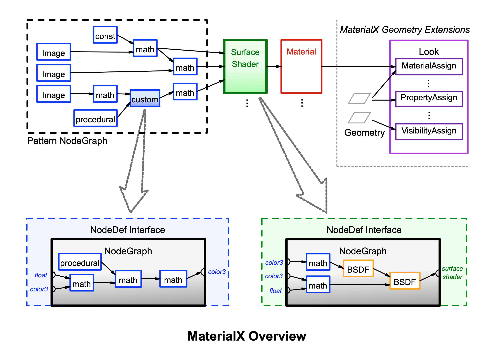
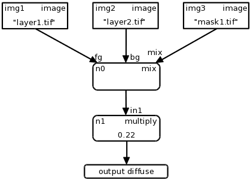
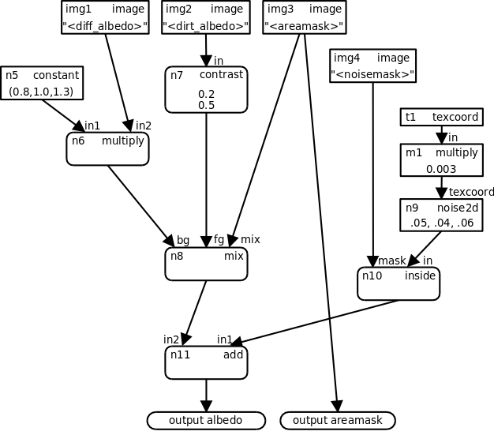

<!-----
MaterialX 规范 v1.39
----->


# MaterialX: 基于网络的 CG 对象外观开放标准

**版本 1.39**  
Doug Smythe - Industrial Light & Magic  
Jonathan Stone - Lucasfilm Advanced Development Group  
2025年3月15日


# 简介

计算机图形制作工作室通常使用涉及多个软件工具的工作流程来处理制作流程的不同部分。跨设施的工作共享和外包也很常见,要求公司将完全开发好外观的模型移交给可能使用不同软件包和渲染系统的其他部门或工作室。此外,以前使用由专家程序员或技术总监构建的单片着色器(具有固定的、预定的纹理到着色器连接和硬编码的纹理颜色校正选项)的工作室渲染管线,现在使用更灵活的基于节点的着色器网络,通过图像处理和操作符图将图像和过程连接到着色器输入。

至少需要四个不同的相互关联的数据关系来指定 CG 对象的完整"外观":

1. _图像处理网络_,包括源、操作符、连接和输入值,输出多个空间变化数据流。
2. _几何体特定信息_,如各种贴图类型的相关纹理文件名或 ID。
3. 空间变化数据流和/或统一值与表面、体积或其他着色器输入之间的关联,定义多个_材质_。
4. 材质与特定几何体之间的关联,创建多个_外观_。

**MaterialX** 通过定义材质内容模式以及相应的基于 XML 的文件格式来读取和写入 MaterialX 内容,解决了为使用节点网络构建的计算机图形对象指定"外观"的开放、平台独立、明确定义的标准的需要。MaterialX 模式定义了许多主要元素类型以及几种补充和子元素类型,还有一套**标准节点**,具有用于定义数据处理图、着色器和材质的特定功能。

本文档描述了核心 MaterialX 规范。配套文档 [**MaterialX 标准节点**](./MaterialX.StandardNodes.md)、[**MaterialX 基于物理的着色节点**](./MaterialX.PBRSpec.md) 和 [**MaterialX NPR 着色节点**](./MaterialX.NPRSpec.md) 描述了 MaterialX 的标准数学、模式和着色节点,而配套文档 [**MaterialX 几何扩展**](./MaterialX.GeomExts.md) 和 [**MaterialX 补充说明**](./MaterialX.Supplement.md) 描述了额外的元素类型和关于库的其他信息,[**MaterialX: 拟议的添加和更改**](./MaterialX.Proposals.md) 描述了 MaterialX 的前瞻性拟议功能。


## 目录

**[引言](#introduction)**  

**[MaterialX 概述](#materialx-overview)**  
 [定义](#definitions)  
 [MaterialX 名称](#materialx-names)  
 [MaterialX 数据类型](#materialx-data-types)  
 [自定义数据类型](#custom-data-types)  
 [MTLX 文件格式定义](#mtlx-file-format-definition)  
 [色彩空间和色彩管理系统](#color-spaces-and-color-management-systems)  
 [单位](#units)  
 [MaterialX 命名空间](#materialx-namespaces)  
 [几何属性](#geometric-properties)  
 [几何空间](#geometric-spaces)  
 [文件前缀](#file-prefixes)  
 [文件名替换](#filename-substitutions)

**[节点](#nodes)**  
 [输入](#inputs)  
 [节点图元素](#node-graph-elements)  
 [输出元素](#output-elements)  
 [标准节点](#standard-nodes)  
 [标准节点输入](#standard-node-inputs)  
 [标准 UI 属性](#standard-ui-attributes)  
 [背景元素](#backdrop-elements)  
 [节点图示例](#node-graph-examples)  

**[自定义、目标和着色](#customization-targeting-and-shading)**  
 [目标定义](#target-definition)  
 [自定义属性和输入](#custom-attributes-and-inputs)  

 [自定义节点](#custom-nodes)  
  [自定义节点声明 NodeDef 元素](#custom-node-declaration-nodedef-elements)  
   [NodeDef 参数接口](#nodedef-parameter-interface)  
   [NodeDef 输入元素](#nodedef-input-elements)  
   [NodeDef 令牌元素](#nodedef-token-elements)  
   [NodeDef 输出元素](#nodedef-output-elements)  
  [使用 Implementation 元素定义自定义节点](#custom-node-definition-using-implementation-elements)  
   [由外部文件实现定义的示例自定义节点](#example-custom-nodes-defined-by-external-file-implementations)  
  [使用节点图定义自定义节点](#custom-node-definition-using-node-graphs)  
   [功能节点图](#functional-nodegraphs)  
   [复合节点图](#compound-nodegraphs)  
   [由节点图定义的示例自定义节点](#example-custom-node-defined-by-a-nodegraph)  
  [自定义节点使用](#custom-node-use)  
 [着色器节点](#shader-nodes)  
 [材质节点](#material-nodes)  
  [着色前合成材质示例](#example-pre-shader-compositing-material)  
 [材质变体](#material-variants)  

**[参考文献](#references)**

<br>


# MaterialX 概述

下图给出了典型的 MaterialX 外观定义的高级概述。模式生成和处理节点的有向无环图连接到表面着色器的输入,该着色器定义了分层 BSDF 响应。一个或多个着色器可以连接形成材质,该材质最终通过材质分配与特定场景几何体关联,多个材质分配组成外观。在支持 MaterialX 几何扩展的应用程序中,材质到几何体的分配可以在 MaterialX 文档中定义,或者使用替代机制(如 USD[^1] 或原生应用程序的工具集)定义。每个模式节点甚至着色器本身都可以使用节点图来实现:这些节点图使用节点定义给出参数接口,这些实现可以像任何其他由 MaterialX 定义的标准节点一样,以不同的输入值重用。



MaterialX 还允许指定此图中未显示的附加信息,例如几何体特定属性、材质变化、节点的任意自定义输入和属性、着色器/节点和实现的渲染目标特定版本、外部编译或生成的着色器实现等等。


## 定义

因为同一个词在不同的上下文中可能有略微不同的含义,而且每个工作室和软件包都有自己的词汇表,所以在本提案中准确定义我们使用的每个术语并一致地使用它们非常重要。

**元素(Element)**是 MaterialX 文档中的命名对象,可以拥有任意数量的子元素和属性。**属性(Attribute)**是 MaterialX 元素的命名属性。

**节点(Node)**是生成或操作空间变化数据的函数。本规范提供了一组具有精确定义的标准节点,还支持为应用程序特定用途创建自定义节点。节点传入数据的接口通过**输入(Inputs)**声明,这些输入可以是空间变化的或统一的,以及**令牌(Tokens)**,这些令牌是可以替换到节点输入中声明的文件名中的字符串值。节点传出数据的接口通过一个或多个**输出(Outputs)**声明;节点的输入、令牌和输出统称为节点的**端口(Ports)**。

**模式(Pattern)**是生成或处理简单标量、向量和颜色数据的节点,可以访问任何已绑定几何体的局部属性。

**着色器(Shader)**是可以生成或处理任意光照或 BSDF 数据的节点,可以访问其评估场景的全局属性。

**材质(Material)**是在内部或外部引用一个或多个着色器的节点,其输入绑定了特定的数据流或统一值。

**节点图(Node Graph)**是节点的有向无环图,可用于定义任意复杂的生成或处理网络。节点图的常见用途是描述流入着色器输入的模式节点网络,或者根据更简单的节点定义复杂或分层节点。

**流(Stream)**指从一个节点到另一个节点的空间变化数据流。流最常见的是由颜色、向量或标量数据组成,但可以传输任何标准或自定义类型的数据。

**图层(Layer)**是图像文件内命名的 1、2、3 或 4 通道颜色"平面"。不支持文件中多个或命名图层的图像文件格式应被视为单个图层名为 "rgba"。

**通道(Channel)**是颜色或向量值中的单个浮点值,例如图像的每个图层可能有一个红色通道、一个绿色通道、一个蓝色通道和一个 alpha 通道。

**几何体(Geometry)**是任何可渲染对象,而**分区(Partition)**指几何体中特定的命名可渲染子集,例如面集。

**集合(Collection)**是构建几何体列表的方案,可用作在外观中将材质分配给多个几何体的简写。

**目标(Target)**是解释 MaterialX 内容以生成图像的软件环境,常见示例包括数字内容创作工具和 3D 渲染器。


## MaterialX 名称

MaterialX 中的所有元素(节点、材质、着色器等)都需要具有类型为 "string" 的 `name` 属性。MaterialX 元素的 `name` 属性是其唯一标识符,同一范围内的任何两个元素(即具有相同父元素的元素)不能共享名称。

元素名称仅限于 ASCII 字符集中的大写和小写字母、数字和下划线("_");所有其他字符和符号都不允许使用。MaterialX 名称区分大小写,不允许以数字开头。


## MaterialX 数据类型

MaterialX 中的所有值、输入和输出端口以及流都是强类型的,并与特定的数据类型显式关联。MaterialX 定义了以下标准数据类型:

**基本类型**:

```
    integer, boolean, float,
    color3, color4,
    vector2, vector3, vector4,
    matrix33, matrix44, string, filename
```

**数组类型**:

```
    integerarray, floatarray,
    color3array, color4array,
    vector2array, vector3array, vector4array,
    stringarray
```


以下示例显示了 MTLX 文件中 MaterialX 属性的适当语法:

**整数(Integer)**、**浮点数(Float)**:引号内的值:

```
    integervalue = "1"
    floatvalue = "1.0"
```

**布尔值(Boolean)**:引号内的小写单词 "true" 或 "false":

```
    booleanvalue = "true"
```

**颜色(Color)**类型:MaterialX 支持两种不同的颜色类型:

* color3 (红、绿、蓝)
* color4 (红、绿、蓝、alpha)

颜色通道值应该用逗号分隔(可以有空格也可以没有),在引号内:

```
    color3value = "0.1,0.2,0.3"
    color4value = "0.1,0.2,0.3,1.0"
```

注意:所有 color3 值和 color4 值的 RGB 分量都假定在封闭的 &lt;materialx&gt; 元素中定义的"工作色彩空间"中指定,尽管文档中的任何元素都可以提供 `colorspace` 属性,明确声明其范围内颜色值应解释的空间;实现应在使用这些值执行计算之前将这些颜色值转换为工作色彩空间。请参阅下面的 [色彩空间和色彩管理系统](#color-spaces-and-color-management-systems) 部分。

**向量(Vector)**类型:与颜色类似,MaterialX 支持三种不同的向量类型:

* vector2 (x, y)
* vector3 (x, y, z)
* vector4 (x, y, z, w)

坐标值应该用逗号分隔(可以有空格也可以没有),在引号内:

```
    vector2value = "0.234,0.885"
    vector3value = "-0.13,12.883,91.7"
    vector4value = "-0.13,12.883,91.7,1.0"
```

虽然 color<em>N</em> 和 vector<em>N</em> 类型都描述浮点值向量,但它们在许多重要方面有所不同。首先,color4 值的最后一个通道被合成运算符解释为 alpha 通道,仅在 [0, 1] 范围内有意义,而 vector4 值的第四个通道_可以_(但不一定)被解释为齐次 3D 向量的 "w" 值。此外,color3 和 color4 类型的值始终与特定色彩空间关联并受颜色转换影响,而 vector3 和 vector4 类型的值则不受影响。有关 color<em>N</em> 和 vector<em>N</em> 操作的更详细规则可在规范的 [标准操作符节点](./MaterialX.StandardNodes.md#standard-operator-nodes) 部分找到。

**矩阵(Matrix)**类型:MaterialX 支持两种可用于表示几何和颜色转换的矩阵类型。`matrix33` 和 `matrix44` 类型分别表示 3x3 和 4x4 矩阵,写为九个或十六个用逗号分隔的浮点值,按行主序排列:

```
    matrix33value = "1,0,0, 0,1,0, 0,0,1"
    matrix44value = "1,0,0,0, 0,1,0,0, 0,0,1,0, 0,0,0,1"
```

**字符串(String)**:引号内的字面文本。有关在字符串数据中表示特殊字符的详细信息,请参阅 [MTLX 文件格式定义](#mtlx-file-format-definition) 部分。

```
    stringvalue = "some text"
```

**文件名(Filename)**:类型为 "filename" 的属性只是引号内的字符串,但特指统一资源标识符 ([https://en.wikipedia.org/wiki/Uniform_Resource_Identifier](https://en.wikipedia.org/wiki/Uniform_Resource_Identifier)),可选地包含一个或多个文件名替换字符串(见下文),表示对外部资产的引用,例如磁盘上的文件或内容管理系统中的查询。

```
    filevalue = "diffuse/color01.tif"
    filevalue = "/s/myshow/assets/myasset/v102.1/wetdrips/drips.{frame}.tif"
    filevalue = "https://github.com/organization/project/tree/master/src/node.osl"
    filevalue = "cmsscheme:myassetdiffuse.<UDIM>.tif?ver=current"
```

**整数数组(IntegerArray)**、**浮点数数组(FloatArray)**、**Color3数组(Color3Array)**、**Color4数组(Color4Array)**、**Vector2数组(Vector2Array)**、**Vector3数组(Vector3Array)**、**Vector4数组(Vector4Array)**、**字符串数组(StringArray)**:任意数量(包括零)相同基本类型的值,用逗号分隔(可以有空格也可以没有),在引号内;color3、color4、vector2、vector3 或 vector4 的数组只是按顺序排列的通道值的一维列表,例如 "r0, g0, b0, r1, g1, b1, r2, g2, b2"。stringarray 中的单个字符串值不能包含逗号或分号,并且其中的任何前导和尾随空格字符都将被忽略。MaterialX 不支持多维或嵌套数组。节点的数组类型输入必须是静态统一值,其长度由节点的另一个统一输入值指定,或由节点的实现要求隐式指定。节点不能输出数组类型。

```
    integerarrayvalue = "1,2,3,4,5"
    floatarrayvalue = "1.0, 2.2, 3.3, 4.4, 5.5"
    color3arrayvalue = ".1,.2,.3, .2,.3,.4, .3,.4,.5"
    color4arrayvalue = ".1,.2,.3,1, .2,.3,.4,.98, .3,.4,.5,.9"
    vector2arrayvalue = "0,.1, .4,.5, .9,1.0"
    vector3arrayvalue = "-0.2,0.11,0.74, 5.1,-0.31,4.62"
    vector4arrayvalue = "-0.2,0.11,0.74,1, 5.1,-0.31,4.62,1"
    stringarrayvalue = "hello, there, world"
```


## 自定义数据类型

除了标准数据类型外,MaterialX 还支持为着色器和自定义节点的输入和输出指定自定义数据类型。这允许文档描述应用程序可能需要的任何复杂类型的数据流;示例可能包括光谱颜色样本或复合几何数据。可以使用多个 &lt;member&gt; 元素描述自定义类型内容的结构,但也只声明自定义类型的名称并将该类型视为"盲数据"。

可以声明类型具有特定的语义,这可用于确定应如何解释该类型的值,以及如何连接输出该类型的节点。目前,MaterialX 定义了三种语义:

* "`color`": 该类型被解释为代表或包含颜色,因此应按照 [色彩空间和色彩管理系统](#color-spaces-and-color-management-systems) 部分所述进行色彩管理。
* "`shader`": 该类型被解释为着色器输出类型;输出具有 "shader" 语义的类型的节点或节点图可用于定义着色器类型节点,该节点可以连接到 "material" 类型节点的输入。
* "`material`": 该类型被解释为材质输出类型;输出具有 "material" 语义的类型的节点或节点图可以在 &lt;look&gt; 中由 &lt;materialassign&gt; 引用。

未定义特定语义的类型假定具有 semantic="default"。

使用 &lt;typedef&gt; 元素定义自定义类型:

```xml
  <typedef name="spectrum" semantic="color"/>
  <typedef name="texcoord_struct">
    <member name="s" type="float" value="0.0"/>
    <member name="t" type="float" value="0.0"/>
  </typedef>
```

&lt;typedef&gt; 元素的属性:

* `name` (string, 必需): 此类型的名称。不能与内置 MaterialX 类型相同。为了减少自定义类型名称与代码生成可能创建的变量名称之间可能的符号冲突,我们建议使用 `_struct` 作为类型名称的后缀。
* `semantic` (string, 可选): 此类型的语义(见上文);默认语义为 "default"。
* `context` (string, 可选): 应应用此类型的语义特定上下文。对于 "shader" 语义类型,`context` 定义了解释着色器输出的渲染上下文;详情请参阅 [着色器节点](#shader-nodes) 部分。
* `inherit` (string, 可选): 此类型继承自的另一个类型的名称,可以是内置类型或自定义类型。没有此类型定义的应用程序可以使用继承的类型作为"回退"类型。
* `hint` (string, 可选): 帮助创建代码生成器的人员理解如何定义该类型的提示。目前定义了以下 typedef 提示:
    * "halfprecision": 此类型内的值是半精度
    * "doubleprecision": 此类型内的值是双精度

&lt;member&gt; 元素的属性:

* `name` (string, 必需): 成员变量的名称。在此自定义类型的其他成员名称列表中必须唯一。
* `type` (string, 必需): 成员变量的类型;可以是任何内置 MaterialX 类型,或任何先前定义的自定义类型;不支持 &lt;member&gt; 类型的递归包含。
* `value` (string, 必需): 成员变量的默认值。

如果提供了多个 <member> 元素,则 MaterialX 文件可以在使用该类型的任何地方指定该类型的值,作为大括号包围、分号分隔的数字和字符串列表,期望分号之间的数字和字符串按顺序与预期的 <member> 类型完全对应。使用大括号允许嵌套自定义结构类型初始化器。例如,如果声明了以下 <typedef>:

```xml
  <typedef name="exampletype_struct">
    <member name="id" type="integer" value="2"/>
    <member name="compclr" type="color3" value="0.2,0.4,0.6"/>
    <member name="objects" type="stringarray" value="whiz,bang"/>
    <member name="minvec" type="texcoord_struct" value="{0.2,0.2}"/>
    <member name="maxvec" type="vector2" value="0.5,0.7"/>
  </typedef>
```

那么在使用该类型的自定义节点中,允许的输入声明可以是:

```xml
  <input name="in2" type="exampletype" value="{3; 0.18,0.2,0.11; foo,bar; {0.0,1.0}; 3.4,5.1}"/>
```

如果未提供 <member> 子元素,例如如果自定义类型的内容不能表示为 MaterialX 类型列表,则无法提供值,并且此类型只能用于将盲数据从一个自定义节点的输出传递到另一个自定义节点或着色器输入。

一旦由 &lt;typedef&gt; 定义了自定义类型,就可以在任何允许"任何 MaterialX 类型"的 MaterialX 元素中使用它;MaterialX 类型列表实际上被扩展为包含新的自定义类型。然而,应该注意的是,&lt;typedef&gt; 只是声明类型的存在以及可能关于其预期定义的一些提示,但由每个应用程序和代码生成器为任何类型提供其自己的精确定义。

标准 MaterialX 发行版包括四种 "shader" 语义数据类型的定义:**surfaceshader**、**displacementshader**、**volumeshader** 和 **lightshader**。这些类型将在下面的 [着色器节点](#shader-nodes) 部分更详细地讨论。


## MTLX 文件格式定义

MTLX 文件(文件扩展名为 ".mtlx")具有以下一般形式:

```xml
  <?xml version="1.0" encoding="UTF-8"?>
  <materialx version="major.minor" [root-level attributes]>
    <!-- various combinations of MaterialX elements and sub-elements -->
  </materialx>
```

即,标准的 XML 声明行后跟根 &lt;materialx&gt; 元素,其中包含任意数量的 MaterialX 元素和子元素。MTLX 文件的默认字符编码为 UTF-8,MaterialX 实现中字符串值的内存表示也期望使用此编码。

支持标准 XML XInclude ([http://en/wikipedia.org/wiki/XInclude](http://en/wikipedia.org/wiki/Xinclude)),以及标准 XML 注释和 XML 字符实体 `&quot;`、`&amp;`、`&apos;`、`&lt;` 和 `&gt;`:

```xml
  <xi:include href="includedfile.mtlx"/>
  <!-- this is a comment -->
  <input name="example" type="string" value="&quot;text in quotes&quot;"/>
```

为了支持 stringarray 类型,MaterialX 支持一种非标准 XML 约定,其中逗号(和任何后续空格)是 stringarray 中字符串的分隔符,反斜杠后面的逗号或分号被解释为常规逗号或分号而不是分隔符,两个反斜杠被解释为单个反斜杠。

每个 XIncluded 文档本身必须是有效的 MTLX 文件,包含 XML 头和其自己的根 `<materialx>` 元素,其子元素将添加到包含文档的根元素中。分层根级属性(如 `colorspace` 和 `namespace`)将分发到包含的子元素,以在包含的 MaterialX 文档中保持正确的语义。

&lt;materialx&gt; 元素的属性:

* `version` (string, 必需): 包含此文档符合的 MaterialX 规范版本号的字符串,指定为由点分隔的主版本号和次版本号。MaterialX 库在加载时自动将旧版本文档升级到当前 MaterialX 版本。
* `colorspace` (string, 可选): 此元素及其所有后代的"工作色彩空间"的名称。这是所有图像输入和颜色值的默认色彩空间,也是执行所有颜色计算的色彩空间。默认为 "none",表示不进行色彩管理。
* `namespace` (string, 可选): 定义在此 &lt;materialx&gt; 范围内定义的所有元素的命名空间。详情请参阅下面的 [MaterialX 命名空间](#materialx-namespaces) 部分。


## 色彩空间和色彩管理系统

MaterialX 支持使用色彩管理系统将 RGB 颜色和图像与特定色彩空间关联。MaterialX 文档通常指定创建它们的应用程序的工作色彩空间,文档中描述的任何输入颜色或图像如果与工作色彩空间不同,可以指定其色彩空间的名称。这允许使用 MaterialX 的应用程序在摄取时将输入颜色和图像中的颜色值从其原始色彩空间转换为所需的工作色彩空间。MaterialX 不指定_如何_或_何时_转换颜色值:这由主机应用程序决定,它可以使用任何适当的方法,包括代码生成、将图像加载到内存时进行转换、维护缓存或预转换的图像纹理等。通常假定 MaterialX 文档的工作色彩空间是线性的(与对数、显示参考空间如 sRGB 或其他非线性编码相反),尽管这不是严格要求。

默认情况下,MaterialX 支持 ACES 1.2 ([http://www.oscars.org/science-technology/sci-tech-projects/aces)](http://www.oscars.org/science-technology/sci-tech-projects/aces) 中定义的以下色彩空间,渲染 MaterialX 文档的应用程序应将这些空间中的输入颜色和图像转换为其渲染器的色彩空间。提供此支持的一个直接选项是利用 MaterialX 代码生成器,它自动支持这些转换,但应用程序可以使用任何适当的方法自行处理转换。

* `srgb_texture`
* `lin_rec709`
* `g22_rec709`
* `g18_rec709`
* `acescg`
* `lin_ap1 ("acescg" 的别名)`
* `g22_ap1`
* `g18_ap1`
* `lin_srgb`
* `adobergb`
* `lin_adobergb`
* `srgb_displayp3`
* `lin_displayp3`

MaterialX 文档的工作色彩空间由其根 &lt;materialx&gt; 元素的 `colorspace` 属性定义,强烈建议所有 &lt;materialx&gt; 元素如果希望使用色彩管理工作流程而不是依赖外部配置文件的默认色彩空间设置,则定义特定的 `colorspace`。如果 MaterialX 文档被 xi:included 到另一个 MaterialX 文档中,它将继承父文档的工作色彩空间设置,除非它自己声明了特定的工作色彩空间。

单个颜色图像文件和值的色彩空间可以通过定义文件名或值的输入中的 `colorspace` 属性来定义。其他元素(如 &lt;nodegraph&gt; 或节点实例)允许定义将应用于其范围内元素的 `colorspace` 属性;未显式提供 `colorspace` 属性的输入和文件中的颜色值将被视为处于定义 `colorspace` 属性的最近封闭范围的色彩空间中。非工作色彩空间中的颜色图像和值应在执行计算之前由应用程序转换为工作空间。在下面的示例中,图像文件已在 "srgb_texture" 色彩空间中定义,而其默认值已在 "lin_rec709" 中定义;两者都应在应用于任何计算之前转换为应用程序的工作色彩空间。

```xml
  <image name="in1" type="color3">
    <input name="file" type="filename" value="input1.tif"
         colorspace="srgb_texture"/>
    <input name="default" type="color3" value="0.5,0.5,0.5"
         colorspace="lin_rec709"/>
  </image>
```

MaterialX 保留色彩空间名称 "none" 表示不应对其范围内的图像和颜色值应用色彩空间转换,无论局部范围与文档或应用程序工作色彩空间设置之间 stated 色彩空间有何差异。


## 单位

MaterialX 允许根据特定单位和单位类型定义浮点和向量值,并可以自动将值从其指定单位转换为应用程序指定的同类型场景单位。这允许图像及其表示的量(如位移量)以绝对真实世界大小指定,然后自动转换为应用程序预期的场景单位。

单元类型使用 &lt;unittypedef&gt; 元素定义,该类型的一组单位使用具有一个或多个子 &lt;unit&gt; 元素的 &lt;unitdef&gt; 元素定义。MaterialX 预定义了以下单元类型和单位:


## 单位

MaterialX 允许根据特定单位和单位类型定义浮点和向量值,并可以自动将值从其指定单位转换为应用程序指定的同类型场景单位。这允许图像及其表示的量(如位移量)以绝对真实世界大小指定,然后自动转换为应用程序预期的场景单位。

单元类型使用 &lt;unittypedef&gt; 元素定义,该类型的一组单位使用具有一个或多个子 &lt;unit&gt; 元素的 &lt;unitdef&gt; 元素定义。MaterialX 预定义了以下单元类型和单位:

```xml
  <unittypedef name="distance"/>
  <unitdef name="UD_stdlib_distance" unittype="distance">
    <unit name="nanometer" scale="0.000000001"/>
    <unit name="micron" scale="0.000001"/>
    <unit name="millimeter" scale="0.001"/>
    <unit name="centimeter" scale="0.01"/>
    <unit name="inch" scale="0.0254"/>
    <unit name="foot" scale="0.3048"/>
    <unit name="yard" scale="0.9144"/>
    <unit name="meter" scale="1.0"/>
    <unit name="kilometer" scale="1000.0"/>
    <unit name="mile" scale="1609.34"/>
  </unitdef>
  <unittypedef name="angle"/>
  <unitdef name="UD_stdlib_angle" unittype="angle">
    <unit name="degree" scale="1.0"/>
    <unit name="radian" scale="57.295779513"/>
  </unitdef>
```

&lt;unittypedef> 定义单位名称,而 &lt;unitdef> 为单元类型定义任意数量的单位以及相对于其他单位的乘法转换 `scale` 值。可以通过提供具有相同 `unittype` 属性值的另一个 &lt;unitdef> 来完成任何单元类型的其他单位定义。

任何输入或其他浮点值都可以指定 `unit` 和/或 `unittype` 属性,具体遵循本文档中澄清的准则。单位和单元类型也可以用于 floatarray、vector<em>N</em> 和 vector<em>N</em>array 量,其中向量的所有分量或数组中的所有值都使用相同的单位,以及 "filename" 类型输入,在这种情况下,`unit` 和/或 `unittype` 属性适用于从这些文件读取的 float 或 vector<em>N</em> 值。并不期望所有输入都有定义的单位或单元类型;事实上,预计绝大多数输入既没有单位也没有单元类型。只有在特定单位很重要且合理预期可能需要进行单位转换的情况下,才应指定单位和单元类型。

请参阅下面的 [输入](#inputs)、[自定义节点声明 NodeDef 元素](#custom-node-declaration-nodedef-elements)、[几何属性](#geometric-properties) 和 [几何节点](./MaterialX.StandardNodes.md#geometric-nodes) 部分以及 MaterialX 标准节点和 MaterialX 几何扩展文档中的其他具体要求以了解单位的使用。


## MaterialX 命名空间

MaterialX 支持指定“命名空间”,它们限定其范围内所有元素的 MaterialX 名称。命名空间通过 &lt;materialx> 元素中的 `namespace` 属性指定,其他 &lt;xi:include> 此 .mtlx 文件的 MaterialX 文件可以引用其内容而无需担心元素或对象命名冲突,类似于在各种编程语言中使用命名空间的方式。允许多个 &lt;materialx> 元素指定相同的命名空间;每个元素的元素将简单地合并到同一个命名空间中。未指定命名空间的 &lt;materialx> 元素将把元素定义到(未命名的)全局命名空间中。MaterialX 命名空间最常用于定义自定义节点(nodedefs)族、材质库或常用的网络着色器或节点图。

对不同命名空间中元素的引用使用语法 "_namespace_:_elementname_" 进行限定,其中 _namespace_ 是被引用元素范围内的命名空间,_elementname_ 是被引用元素的名称。对同一命名空间中的元素或全局命名空间中的元素的引用不应被限定。

#### 命名空间示例

Mtllib.mtlx 包含以下内容(假设 "..." 包含任何必要的材质输入连接和其他元素定义):

```xml
  <?xml version="1.0" encoding="UTF-8"?>
  <materialx version="major.minor" namespace="stdmaterials">
    ...
    <surfacematerial name="wood">
      ...
    </surfacematerial>
    <surfacematerial name="plastic">
      ...
    </surfacematerial>
  </materialx>
```

然后另一个 MaterialX 文件可以这样引用这些材质:

```xml
    <xi:include href="mtllib.mtlx"/>
    ...
    <look name="hero">
      <materialassign name="m1" material="stdmaterials:wood" collection="C_wood">
      <materialassign name="m2" material="stdmaterials:plastic" collection="C_plastic">
    </look>
```

类似地,如果定义 "site_ops" 命名空间的 .mtlx 文件定义了单个 float 输入 "f" 的自定义 color3 类型节点 "mynoise",它可以在节点图中这样使用:

```xml
    <site_ops:mynoise name="mn1" type="color3">
      <input name="f" type="float" value="0.3"/>
    </site_ops:mynoise>
```

`namespace` 属性也可以添加到单个 &lt;nodedef> 或 &lt;nodegraph>,在这种情况下,&lt;nodedef> 的 `name` 和 `node`,或者只是 &lt;nodegraph> 的 `name` 将被分配到指定的 `namespace`。在 &lt;nodegraph> 中,如果它引用的 &lt;nodedef> 是在特定命名空间中定义的,则 `nodedef` 必须包含命名空间引用,即使它与 &lt;nodegraph> 的命名空间相同:这是因为 `namespace` 仅适用于由元素创建或包含在元素内的内容,而不适用于该元素引用的任何外部内容。

```xml
  <nodedef name="ND_myshader" node="myshader" namespace="mynamespace">
    <output name="surfaceshader" type="surfaceshader"/>
  </nodedef>

  <nodegraph name="NG_myshader" nodedef="mynamespace:ND_myshader"
             namespace="mynamespace">
    <standard_surface name="my_surf_shader" type="surfaceshader" >
      <input name="base_color" type="color3" value="0.264575,1.0,1.0" />
    </standard_surface>
    <output name="surfaceshader" type="surfaceshader" nodename="my_surf_shader" />
  </nodegraph>
```


## 几何属性

几何属性或 "geomprops" 是在特定空间和/或索引中引用的几何体的内在或用户定义的表面坐标属性,功能上等同于 USD 的 "primvars" 概念。MaterialX 中预定义了许多几何属性:`position`、`normal`、`tangent`、`bitangent`、`texcoord` 和 `geomcolor`,它们的值可以使用相同名称的元素在节点图中访问;有关详细信息,请参阅 MaterialX 标准节点文档的 [几何节点](./MaterialX.StandardNodes.md#geometric-nodes) 部分。变化几何属性的值也可以用作使用 `defaultgeomprop` 属性的节点输入的默认值。

以下几何属性由 MaterialX 预定义:

| GeomProp 名称 | 类型 | 描述 |
| ---- | ---- | ---- |
| Pobject | vector3 | 对象空间位置 |
| Nobject | vector3 | 对象空间表面法线 |
| Tobject | vector3 | 对象空间切线向量(索引 0) |
| Bobject | vector3 | 对象空间副切线向量(索引 0) |
| Pworld | vector3 | 世界空间位置 |
| Nworld | vector3 | 世界空间表面法线 |
| Tworld | vector3 | 世界空间切线向量(索引 0) |
| Bworld | vector3 | 世界空间副切线向量(索引 0) |
| UV0 | vector2 | 索引 "0" UV 纹理坐标 |

也可以使用 &lt;geompropdef> 元素定义自定义几何属性:

```xml
  <geompropdef name="geompropname" type="geomproptype" [uniform="true|false"]
        [geomprop="geomproperty"] [space="geomspace"] [index="indexnumber"]/>
```

例如:

```xml
  <geompropdef name="Pworld" type="vector3" geomprop="position" space="world"/>
  <geompropdef name="uv1" type="vector2" geomprop="texcoord" index="1"/>
```

geomprop 的 `type` 可以是任何非数组 MaterialX 类型,尽管 `string` 或 `filename` 类型的 geomprops 必须声明为 uniform="true"。"geomprop"、"space" 和 "index" 属性是可选的;如果指定了 "geomprop",它必须是上述标准几何属性之一,如果未指定,则新的 geomprop 是一个盲几何属性,即可以引用但 MaterialX 不知道其详细信息的属性。只有在指定了 "geomprop" 属性且标准 geomproperty 支持时,才可以指定 "space" 和 "index" 属性。对于 `uniform="true"` geomprops,不能指定 "Geomprop"、"space" 和 "index" 属性。

一旦定义,自定义 geomprop 名称可以在任何可以使用标准 geomprop 的地方使用:

```xml
  <nodedef name="ND1" ... internalgeomprops="position, Pworld, normal, uv1">
```

geompropdef 还可以指定 `unittype` 和 `unit` 以指示几何属性是用特定单位定义的。如果使用 &lt;geompropvalue> 在节点图中访问具有定义单位的 geomprop,则几何属性值将从 geompropdef 指定的单位转换为应用程序指定的场景单位。

```xml
  <geompropdef name="objheight" type="float" unittype="distance" unit="meter"/>
```


## 几何空间

各种操作符节点可能需要指定位置或向量所在的 3D 空间。几何节点的 `space` 输入以及从一个空间转换到另一个空间时支持以下值:

* "model": 几何体的局部坐标空间,在应用任何局部位移或全局变换之前。
* "object": 几何体的局部坐标空间,在应用局部位移之后,但在任何全局变换之前。
* "world": 几何体的全局坐标空间,在应用局部位移和全局变换之后。


## 文件前缀

作为简写便利,MaterialX 允许指定 `fileprefix` 属性,该属性将添加到在定义 `fileprefix` 的元素范围内指定的类型为 "filename" 的输入值(例如 `<image>` 节点中的 `file` 输入,或任何类型为 "filename" 的着色器输入)。请注意,`fileprefix` 值仅添加到 `type` 属性明确声明其数据类型为 "filename" 的输入。由于前缀和文件名的值是字符串连接的,因此 `fileprefix` 的值通常应以 "/" 结尾。文件前缀经常用于分离资产目录的公共路径组件,例如定义资产的 "texture root" 目录。

因此以下片段是等效的:

```xml
  <nodegraph name="nodegraph1">
    <image name="in1" type="color3">
      <input name="file" type="filename" value="textures/color/color1.tif"/>
    </image>
    <image name="in2" type="color3">
      <input name="file" type="filename" value="textures/color2/color2.tif"/>
    </image>
  </nodegraph>

  <nodegraph name="nodegraph1" fileprefix="textures/color/">
    <image name="in1" type="color3">
      <input name="file" type="filename" value="color1.tif"/>
    </image>
    <image name="in2" type="color3">
      <input name="file" type="filename" fileprefix="textures/"
            value="color2/color2.tif"/>
    </image>
  </nodegraph>
```

请注意,在第二个示例中,`<image>` "in2" 为自己重新定义了 `fileprefix`,并且同一节点图中的任何其他节点将使用父/封闭范围中定义的文件前缀值 ("textures/color/")。

注意:应用程序实现可以访问原始输入值和属性(例如 "file" 名称和当前 "fileprefix")以及在任何给定元素范围内完全解析的文件名。


## 文件名替换

各种节点的文件名输入值可以包含一个或多个特殊字符串,它们将如下表所述进行替换。&lt;>' 内的替换字符串来自当前几何体,[]' 内的字符串来自 MaterialX 状态,{}' 内的字符串来自主机应用程序环境。

| Token | 描述 |
| ---- | ---- |
| &lt;UDIM> | 一种特殊的几何令牌,将在渲染或评估时根据当前点的 uv 值替换为计算出的四位 Mari 风格 "udim" 值,使用公式 UDIM = 1001 + U + V*10,其中 U 是 u 坐标的整数部分,V 是 v 坐标的整数部分。 |
| &lt;UVTILE> | 一种特殊的几何令牌,将替换为计算的 Mudbox 风格 "u<em>U</em>_v<em>V</em>" 字符串,其中 <em>U</em> 是 1+ u 坐标的整数部分,<em>V</em> 是 1+ v 坐标的整数部分。 |
| [<em>interface token</em>] | 在包含节点图的 &lt;nodedef> 接口中声明的指定令牌的值;令牌的值可以在引用该节点的材质中的着色器节点内或在 &lt;variant> 中设置;如果为当前几何体在多个位置定义了相同的令牌,则会出错。 |
| {<em>hostattr</em>} | 主机应用程序可以定义其他变量,这些变量可以在文件名中解析。 |
| {frame} | 一种特殊字符串,将由主机环境定义的当前帧号替换。 |
| {0<em>N</em>frame} | 一种特殊字符串,将由当前帧号替换,填充零以达到总共 <em>N</em> 位数字(将 <em>N</em> 替换为数字):例如,{04frame} 将被替换为 4 位零填充帧号,如 "0010"。 |


注意:预计实现将在导出时保留文件名中的替换字符串,而不是将它们 "烘焙" 为完全评估的文件名。使用 USD 进行几何体和分配的应用程序还可以使用 &lt;_geometry token_> (又称 "&lt;_primvarname_>") 作为整个文件名字符串来访问不变的整个字符串 primvar 值(尽管该字符串值可能包含 USD 支持的 &lt;UDIM> 令牌)。

<br>


# 节点

节点是单独的数据生成或处理“块”。节点功能可以从简单的操作(如返回常量颜色值或添加两个输入值)到更复杂的图像处理操作、3D 空间数据操作,甚至完整的着色器 BxDF。节点连接在一起形成网络或“节点图”,并在它们之间传递类型化数据流。

单个节点元素的形式为:

```xml
  <nodecategory name="nodename" type="outputdatatype" [version="version"]
               [nodedef="nodedef_name"]>
    <input name="inputname" type="type" [nodename="nodename"] [value="value"]/>
    ...additional input or token elements...
  </nodecategory>
```

其中 _nodecategory_ 是节点的常规“类别”(例如 "image"、"add" 或 "mix"),`name`(字符串,必需)定义此节点实例的名称,该名称在其出现的范围内必须是唯一的,`type`(字符串,必需)指定该节点输出的 MaterialX 类型(通常是 float、color<em>N</em> 或 vector<em>N</em>)。如果应用程序在用户界面中为此节点实例使用不同的名称,则可以向 &lt;_nodecategory_> 元素添加 `uiname` 属性以指示节点向用户显示的名称。

节点元素可以选择指定 "_major_[._minor_]" 格式的 `version` 字符串属性,请求使用该节点定义的特定版本而不是默认版本。通常,节点输入和输出的类型足以消除适用版本的哪个签名是预期的歧义,但如果有必要,节点实例化也可以声明特定的 nodedef 名称以精确定义所需的节点签名。请参阅下面的 [自定义节点声明 NodeDef 元素](#custom-node-declaration-nodedef-elements) 部分以获取更多详细信息。

MaterialX 定义了许多 [标准节点](#standard-nodes),所有实现都应在其架构和能力允许的程度上按描述支持这些节点。可以通过声明参数接口并提供可移植的节点图或目标特定的着色语言实现来定义新节点。有关说明和实现详细信息,请参阅 [自定义节点](#custom-nodes) 部分。


## 输入

节点元素包含零个或多个 &lt;input> 元素,定义每个节点输入的名称、类型和值或连接。输入元素可以通过提供 `value` 属性分配显式统一值,通过提供 `nodename` 属性连接到另一个节点的输出,或通过提供 `nodegraph` 属性连接到节点图的输出。还可以为 &lt;input> 元素提供可选的 `output` 属性,允许输入连接到引用的上游节点或节点图的特定命名输出。如果引用的节点/节点图有多个输出,则需要 `output`;如果它只有一个输出,则 &lt;input> 的 `output` 属性将被忽略。输入元素可以定义为只接受统一值,在这种情况下,输入可以提供 `value` 或 `nodename` 连接到 [&lt;constant> 节点](./MaterialX.StandardNodes.md#node-constant) 的输出(可能通过一个或多个无操作 [&lt;dot> 节点](./MaterialX.StandardNodes.md#node-dot))或任何其他输出明确声明为 "uniform" 的节点,但不能提供 `nodename` 或 `nodegraph` 连接到任何任意节点输出或任何节点图输出。字符串和文件名类型的输入必须是 "uniform",任何数组类型的输入也是如此。输入元素可以连接到节点定义中的外部参数接口,允许它们从材质或节点实例分配值;这包括 "uniform" 和字符串/文件名类型的输入,但是,上面列出的相同可连接性限制适用于材质或节点实例的输入。输入只能连接到相同类型的节点/节点图输出或 nodedef 接口输入,尽管允许将 `string` 类型输出连接到 `filename` 类型输入(但反之亦然)。

节点的 float/vector<em>N</em> 输入或引用包含 float 或 vector<em>N</em> 值的图像文件的 "filename" 类型输入可以通过提供 `unit` 属性为其值指定单位,该单位必须是与 nodedef 中该输入的 `unittype` 相关联的单位(如果指定);有关声明单位和单元类型的详细信息,请参阅上面的 [单位](#units) 部分。如果节点的 nodedef(请参阅下面的 [自定义节点](#custom-nodes) 部分)未为输入声明 `unittype`,则节点可以这样做;不允许在没有在节点或适用的 nodedef 上定义兼容的 `unittype` 的情况下为节点输入提供 `unit`。

```xml
  <constant name="boxwidth" type="float">
    <input name="value" type="float" value="2.39" unittype="distance" unit="foot"/>
  </constant>
```

除非另有说明,否则所有输入默认在所有通道中值为 0(对于 integer、float、color 和 vector 类型),""(对于 string 和 filename 类型),"false"(对于 boolean 类型),单位矩阵(对于 matrix 类型),对于数组类型,由数组基本类型的默认值组成的适当长度数组。

标准 MaterialX 节点只有一个输出,而自定义节点可以有任意数量的输出;有关详细信息,请参阅 [自定义节点](#custom-nodes) 部分。


## 节点图元素

包含任意数量节点和输出声明的图形成节点图,它可以包含在 &lt;nodegraph> 元素中以将它们分组为单个功能单元。有关如何使用节点图描述新节点功能的详细信息,请参阅下面的 [使用节点图的自定义节点定义](#custom-node-definition-using-node-graphs) 部分。

```xml
  <nodegraph name="graphname">
    ...node element(s)...
    ...output element(s)...
  </nodegraph>
```


## 输出元素

输出数据流使用 **&lt;output>** 元素定义,可用于声明哪些输出流可连接到其他 MaterialX 元素。在节点图中,&lt;output> 元素声明一个输出流,当节点图是自定义节点的实现时,该输出流可以连接到着色器输入或另一个图中引用节点的输入。有关将节点图用作节点实现的详细信息,请参阅 [使用节点图的自定义节点定义](#custom-node-definition-using-node-graphs) 部分。

```xml
  <output name="albedo" type="color3" nodename="n9"/>
  <output name="precomp" type="color4" nodename="n13" width="1024" height="512"
          bitdepth="16"/>
```

输出元素的属性:

* `name`(字符串,必需):输出的名称
* `type`(字符串,必需):输出的 MaterialX 类型
* `nodename`(字符串,可选):文档中同一范围内节点的名称,其结果值将输出。此属性对于节点图中的 &lt;output> 元素是必需的,但不允许在 &lt;nodedef> 中的 &lt;output> 元素中使用。
* `output`(字符串,可选):如果 `nodename` 指定的节点有多个输出,则要连接此 &lt;output> 的特定输出的名称。
* `uniform`(布尔值,可选):如果设置为 "true",则此节点的输出被视为统一值,并且此输出可以连接到相同(或兼容)类型的统一输入。由创建节点图的应用程序确保值实际上是统一的。默认为 "false"。

MaterialX 还支持 Output 元素的以下附加属性,用于以 2D 空间处理节点图并为了效率保存或缓存输出为图像的应用程序,例如纹理烘焙或图像缓存。这些属性**不**影响从此 &lt;output> 连接到其他节点的值,例如,它们将保持在工作色彩空间中并保留完整分辨率和位深度精度。

* `colorspace`(字符串,可选):输出图像的色彩空间名称。支持色彩空间管理的应用程序预计将执行将输出颜色转换到此空间所需的转换。
* `width`(整数,可选):输出图像的预期宽度(像素)。
* `height`(整数,可选):输出图像的预期高度(像素)。
* `bitdepth`(整数,可选):输出图像的每通道预期位深度,可用于捕获预期的颜色量化效果。`bitdepth` 的常见值为 8、16、32 和 64。由应用程序确定任何声明位深度的内部表示是什么(例如,缩放因子、有符号或无符号等)。


## 标准节点

MaterialX 的核心部分是其标准节点集,分为五类:源节点、操作符节点、标准着色器节点、基于物理的着色节点和 NPR(非真实感)着色节点。

[**源节点**](./MaterialX.StandardNodes.md#standard-source-nodes) 使用外部数据和/或过程函数形成输出;它们没有任何必需的输入。标准源节点分为以下分类:[纹理节点](./MaterialX.StandardNodes.md#texture-nodes)、[过程节点](./MaterialX.StandardNodes.md#procedural-nodes)、[噪声节点](./MaterialX.StandardNodes.md#noise-nodes)、[形状节点](./MaterialX.StandardNodes.md#shape-nodes)、[几何节点](./MaterialX.StandardNodes.md#geometric-nodes)和 [应用程序节点](./MaterialX.StandardNodes.md#application-nodes)。

[**操作符节点**](./MaterialX.StandardNodes.md#standard-operator-nodes) 处理一个或多个输入流以形成输出。标准操作符节点分为以下分类:[数学节点](./MaterialX.StandardNodes.md#math-nodes)、[逻辑操作符节点](./MaterialX.StandardNodes.md#logical-operator-nodes)、[调整节点](./MaterialX.StandardNodes.md#adjustment-nodes)、[合成节点](./MaterialX.StandardNodes.md#compositing-nodes)、[条件节点](./MaterialX.StandardNodes.md#conditional-nodes)、[通道节点](./MaterialX.StandardNodes.md#channel-nodes)和 [卷积节点](./MaterialX.StandardNodes.md#convolution-nodes)。

[**标准着色器节点**](./MaterialX.StandardNodes.md#standard-shader-nodes) 包括非着色着色器(如位移)和不响应外部光照的着色器。

[**基于物理的着色节点**](./MaterialX.PBRSpec.md) 是实现许多广泛使用的 [BSDF/BSSRDF](./MaterialX.PBRSpec.md#bsdf-nodes)、[发射](./MaterialX.PBRSpec.md#edf-nodes) 和 [体积](./MaterialX.PBRSpec.md#vdf-nodes) 分布函数以及 [实用节点](./MaterialX.PBRSpec.md#utility-nodes) 的着色器语义节点,这些节点对于使用节点图构建复杂的分层渲染着色器非常有用,还有一套完整的 [PBR 着色器节点](./MaterialX.PBRSpec.md#pbr-shader-nodes) 实现开放标准着色模型。

[**NPR 着色节点**](./MaterialX.NPRSpec.md) 是在非真实感着色风格中理想但在某些渲染结构中无法实现的操作。这些包括 [NPR 应用程序节点](./MaterialX.NPRSpec.md#npr-application-nodes)、[NPR 实用节点](./MaterialX.NPRSpec.md#npr-utility-nodes) 和 [NPR 着色节点](./MaterialX.NPRSpec.md#npr-shading-nodes)。


## 标准节点输入

所有定义 `defaultinput` 或 `default` 值的标准节点都支持以下输入:

<a id="nodeinput-disable"> </a>

* `disable`(统一布尔值):如果设置为 true,节点将把其默认输入或值传递到其输出,有效地禁用节点;默认为 false。应用程序可以选择通过在遍历期间跳过禁用的节点并改为传递到 defaultinput 节点的连接或输出节点的默认值来实现 `disable` 输入,而不是在节点实现中使用实际的 `disable` 输入。


## 标准 UI 属性

所有元素都支持以下额外的 UI 相关属性:

<a id="attr-doc"> </a>

* `doc`(字符串属性):此元素的功能或用途描述;可以包括标准 HTML 格式字符串,如 &lt;b>、&lt;ul>、&lt;p> 等,但不包括复杂格式,如 CSS 或外部引用(例如,没有超链接或图像)。可用于功能文档或 UI 弹出“工具提示”字符串。


所有节点类型(源、操作符、着色器节点和材质节点)以及 &lt;look> 元素都支持以下 UI 相关属性:

<a id="attr-xpos"> </a>

* `xpos`(浮点属性):在 UI 中绘制时节点左上角的 X 位置。

<a id="attr-ypos"> </a>

* `ypos`(浮点属性):在 UI 中绘制时节点左上角的 Y 位置。

<a id="attr-width"> </a>

* `width`(浮点属性):在 UI 中绘制时节点的相对宽度;默认为 1.0。

<a id="attr-height"> </a>

* `height`(浮点属性):在 UI 中绘制时节点的相对高度;默认为 1.0。

<a id="attr-uicolor"> </a>

* `uicolor`(color3 属性):在 UI 中绘制的节点的显示参考颜色,归一化到 0.0-1.0 范围;默认不指定特定颜色,因此将使用应用程序的默认节点颜色。`uicolor` 值表示为 "none" 色彩空间中的 color3 值,因此不受当前 `colorspace` 的影响。

所有定位和大小属性值都相对于应用程序绘制节点(包括任何最小长度连接边和箭头)的默认大小指定。因此,如果连接到位于 (xpos+width, ypos) 和 (xpos, ypos+height) 位置的节点,则绘制在位置 (xpos, ypos) 的节点将“看起来不错”,并且指定 `width="2"` 的节点将绘制为具有默认宽度的节点的两倍宽(包括用于最小连接箭头的外部空白)。没有必要将节点精确放置在整数网格边界上;这仅说明节点的缩放比例。也不假设 X 和 Y 的像素缩放因子相同:实际的 UI 单位“网格”不必是正方形。如果 xpos 和 ypos 未同时指定,则在 UI 中绘制节点时的位置未定义,由应用程序决定位置(这可能意味着“全部堆积在中心,形成一团混乱”)。

MaterialX 定义 xpos 值从左到右递增,ypos 值从上到下递增,一般流向通常向下。例如,节点输入在顶部,输出在底部,位于 (10, 10) 的节点可以自然地连接到位于 (10, 11) 的节点。使用从左到右流的内容创建应用程序可以在读取或写入 MaterialX 数据时在其内部表示中交换 X 和 Y 坐标,并且在内部使用 Y 坐标向上而不是向下增加的应用程序可以在 MTLX 文件与其内部表示之间反转 Y 坐标。

&lt;nodedef> 和节点实例中的 &lt;input> 和 &lt;token> 元素(但不在 &lt;implementation> 或 &lt;nodegraph> 参数接口中)支持以下 UI 相关属性:

<a id="attr-uivisible"> </a>

* `uivisible`(布尔属性):输入在 UI 中是否可见。如果在 &lt;nodedef> 的输入/令牌上指定了 `uivisible`,则定义该输入/令牌的默认可见性,而在节点实例的输入/令牌上指定的 `uivisible` 仅影响该特定实例中输入/令牌的可见性。默认为 "true"。

<a id="attr-uiadvanced"> </a>

* `uiadvanced`(布尔属性):输入是否被视为“高级”参数,应用程序可以选择在更“基本”模式下隐藏该参数。通常应仅在 &lt;nodedef> 中声明。默认为 "false",表示如果 `uivisible` 为 true,则应显示输入,而 "true" 表示如果 `uivisible` 为 true 且应用程序 UI 设置为显示“高级”参数,则将显示输入。


## 背景元素

背景元素用于在节点图中包含、分组和记录节点,它们对图的功能没有影响。&lt;backdrop> 元素支持以下属性:

* `contains`(stringarray 属性):背景“包含”的节点名称的逗号分隔列表;默认为不包含任何节点。
* `minimized`(布尔属性):此背景是否在应用程序的 UI 中折叠为单个节点大小的框;默认为 false。

背景元素还支持标准的 `width`、`height`、`xpos`、`ypos` 和 `doc` 属性。


## 节点图示例

以下示例演示 MaterialX 文档如何编码节点图。


#### 节点图示例 1

两个单层图像与单独掩码图像的简单合并,然后是简单的颜色操作。



```xml
<?xml version="1.0" encoding="UTF-8"?>
<materialx>
  <image name="img1" type="color3">
    <input name="file" type="filename" value="layer1.tif"/>
  </image>
  <image name="img2" type="color3">
    <input name="file" type="filename" value="layer2.tif"/>
  </image>
  <image name="img3" type="float">
    <input name="file" type="filename" value="mask1.tif"/>
  </image>
  <mix name="n0" type="color3">
    <input name="fg" type="color3" nodename="img1"/>
    <input name="bg" type="color3" nodename="img2"/>
    <input name="mix" type="float" nodename="img3"/>
  </mix>
  <multiply name="n1" type="color3">
    <input name="in1" type="color3" nodename="n0"/>
    <input name="in2" type="float" value="0.22"/>
  </multiply>
  <output name="diffuse" type="color3" nodename="n1"/>
</materialx>
```


#### 节点图示例 2

一个更复杂的节点图,使用几何属性定义两个漫反射反照率颜色和两个掩码,然后对一个反照率进行颜色校正(减少红色,增加蓝色)并增加另一个的对比度,通过区域掩码混合两者,并在第二个掩码内添加少量缩放的 2D Perlin 噪声。该图将区域掩码层与合成的漫反射反照率颜色分开输出。



```xml
<?xml version="1.0" encoding="UTF-8"?>
<materialx>
  <image name="img1" type="color3">
    <input name="file" type="filename" value="<diff_albedo>"/>
  </image>
  <image name="img2" type="color3">
    <input name="file" type="filename" value="<dirt_albedo>"/>
  </image>
  <image name="img3" type="float">
    <input name="file" type="filename" value="<areamask>"/>
  </image>
  <image name="img4" type="float">
    <input name="file" type="filename" value="<noisemask>"/>
  </image>
  <constant name="n5" type="color3">
    <input name="value" type="color3" value="0.8,1.0,1.3"/>
  </constant>
  <multiply name="n6" type="color3">
    <input name="in1" type="color3" nodename="n5"/>
    <input name="in2" type="color3" nodename="img1"/>
  </multiply>
  <contrast name="n7" type="color3">
    <input name="in" type="color3" nodename="img2"/>
    <input name="amount" type="float" value="0.2"/>
    <input name="pivot" type="float" value="0.5"/>
  </contrast>
  <mix name="n8" type="color3">
    <input name="fg" type="color3" nodename="n7"/>
    <input name="bg" type="color3" nodename="n6"/>
    <input name="mix" type="float" nodename="img3"/>
  </mix>
  <texcoord name="t1" type="vector2"/>
  <multiply name="m1" type="vector2">
    <input name="in1" type="vector2" nodename="t1"/>
    <input name="in2" type="float" value="0.003"/>
  </multiply>
  <noise2d name="n9" type="color3">
    <input name="texcoord" type="vector2" nodename="m1"/>
    <input name="amplitude" type="vector3" value="0.05,0.04,0.06"/>
  </noise2d>
  <inside name="n10" type="color3">
    <input name="mask" type="float" nodename="img4"/>
    <input name="in" type="color3" nodename="n9"/>
  </inside>
  <add name="n11" type="color3">
    <input name="in1" type="color3" nodename="n10"/>
    <input name="in2" type="color3" nodename="n8"/>
  </add>
  <output name="albedo" type="color3" nodename="n11"/>
  <output name="areamask" type="float" nodename="img3"/>
</materialx>
```

<br>


# 定制、目标和着色

虽然标准节点被认为在所有 MaterialX 应用程序中是通用的,但在许多情况下,人们希望用新的自定义功能扩展此功能,或定义特定于不同应用程序或渲染器的功能或底层实现。这包括着色和材质的节点定义。


## 目标定义

MaterialX 支持定义特定于特定渲染“目标”的节点、属性和输入。这允许单个实现将某些值或节点限制为仅对其有效的目标,或允许为不同的渲染器定义相同节点功能的单独定义。

目标使用 &lt;targetdef> 元素声明:

```xml
  <targetdef name="oslpattern"/>
  <targetdef name="glsl"/>
  <targetdef name="mdl"/>
```

目标可以从另一个目标继承,因此对父目标的任何引用将自动包含为继承的子目标定义的任何定义,这些定义没有父目标本身的定义:

```xml
  <targetdef name="osl" inherit="oslpattern"/>
  <targetdef name="vrayglsl" inherit="glsl"/>
  <targetdef name="vrayosl" inherit="oslpattern"/>
```

在上面的示例中,任何请求 "osl" 目标的节点/输入/属性的渲染器也将看到用 `target="oslpattern"` 定义的任何节点/输入/属性。渲染器还可以声明它将接受多个目标的实现,例如 Vray 可能声明它将接受 "vrayosl"、"mdl" 或 "vrayglsl",首选 "vrayosl"。

targetdef 元素还可以为该目标指定其他自定义属性,例如配置或代码生成选项。


## 自定义属性和输入

#### 自定义属性

虽然 MaterialX 规范描述了与符合 MaterialX 的应用程序有意义的属性和元素,但允许向标准 MaterialX 元素添加自定义属性和输入。这些自定义属性和子元素被不理解它们的应用程序忽略,尽管应用程序应该保留并重新输出它们及其值和连接,即使它们不理解其含义。

如果应用程序需要与任何 MaterialX 元素相关的其他信息,它可以定义和使用具有非标准名称的其他属性。自定义属性使用 &lt;attributedef> 元素定义:


```xml
  <attributedef name="name" attrname="attrname" type="type" value="defaultvalue"
               [target="targets"] [elements="elements"] [exportable="true"]/>
```

其中 _name_ 是 attributedef 的唯一名称,_attrname_ 是要定义的自定义属性的名称,_type_ 是属性的类型(通常是 string、stringarray、integer 或 boolean,尽管允许任何 MaterialX 类型),_defaultvalue_ 是属性的默认值,_target_ 是此属性适用的目标的可选列表,_elements_ 是可以使用该属性的元素名称或 elementname/inputname 的可选列表。还允许为 attributedef 提供 enum 和 enumvalues 属性,以定义自定义属性允许采用的特定标签和值,使用与 nodedef 输入和令牌上的 enum/enumvalues 相同的语法和限制(见下文)。默认情况下,自定义属性不作为元数据在生成的着色器中发出,但如果 `exportable` 属性设置为 "true",则可以导出。示例:

```xml
  <attributedef name="AD_maxmtlname" attrname="maxmtlname" type="string" value=""
                target="3dsmax" elements="surfacematerial"/>
  <attributedef name="AD_updir" attrname="updir" type="integer" value="1"
                enum="Yup,Zup" enumvalues="1,2"/>
  <attributedef name="AD_img_vflip" attrname="vflip" type="boolean" value="false"
                target="mystudio" elements="image/file"/>
```

上面的第一个示例为表面材质定义了 3ds Max 特定的名称属性,除了其符合 MaterialX 的名称外,还可以为其赋值以保留原始包特定的名称;这里假设 `maxmtlname` 是该特定实现用于此目的的属性名称。第二个示例定义了 "mystudio" 特定的布尔属性 "vflip",它可以在 &lt;image> 节点的 "file" 输入中使用。

一旦定义,自定义属性的使用方式与标准属性完全相同:

```xml
  <surfacematerial name="sssmarble" maxmtlname="SSS Marble">
    <input name="surfaceshader" node="marblesrf"/>
  </surfacematerial>
  <image name="im1" type="color3">
    <input name="file" type="filename" value="X.tif" vflip="true"/>
    ...
  </image>
```

#### 自定义输入

如果应用程序需要在标准 MaterialX 节点中添加其他自定义输入,它可以为该节点定义目标应用程序特定的 &lt;nodedef>,从标准节点的 &lt;nodedef> 继承基本输入定义,然后添加特定于该目标应用程序的输入。

```xml
  <nodedef name="ND_image_color4_maya" node="image" target="maya" inherit="ND_image_color4">
    <input name="preFilter" type="boolean" value="true"/>
  </nodedef>
```

在上面的示例中,已声明 color4 类型 &lt;image> 节点的 Maya 特定版本,从标准声明继承,然后添加 Maya 特定的 "preFilter" 输入。

使用节点时,将自动使用适用于当前目标的定义,其他目标将忽略不属于该目标 nodedef 的任何输入。但是,如果需要,可以在输入上指定文档性 `target` 属性以提示它 intended for 哪个目标。在此示例中,"preFilter" 输入已表明它特定于 "maya" 目标。

```xml
  <image name="image1" type="color4">
    <input name="file" type="filename" value="image1.tif"/>
    <input name="preFilter" type="boolean" value="true" target="maya"/>
  </image>
```


## 自定义节点

特定应用程序通常支持不直接映射到标准 MaterialX 节点的源和操作符。单个实现可以提供自己的自定义节点,使用 &lt;nodedef> 元素声明其参数接口,并使用 &lt;implementation> 和/或 &lt;nodegraph> 元素定义其行为。


### 自定义节点声明 NodeDef 元素

每个自定义节点必须使用 &lt;nodedef> 元素显式声明,子 &lt;input>、&lt;token> 和 &lt;output> 元素指定节点端口的预期名称和类型。

&lt;nodedef> 元素的属性:

* `name`(字符串,必需):此 &lt;nodedef> 的唯一名称
* `node`(字符串,必需):正在定义的自定义节点的名称
* `inherit`(字符串,可选):要从中继承节点定义的 &lt;nodedef> 的 `name`;此 nodedef 和继承的 nodedef 的输出类型必须匹配,并且此 nodedef 的输入/输出定义将应用于继承的 nodedef 之上。
* `nodegroup`(字符串,可选):此节点声明所属的可选组。标准 MaterialX 节点的 `nodegroup` 值与描述它们的章节标题相匹配,例如 "texture2d"、"procedural"、"geometric"、"application"、"math"、"adjustment"、"compositing"、"conditional"、"channel"、"convolution" 或 "organization"。
* `version`(字符串,可选):此 nodedef 的版本字符串,允许节点使用引用节点的特定版本。版本字符串应采用 "_major_[._minor_]" 格式,即一个或两个由点分隔的整数(如果未提供,则次要版本假定为 "0")。如果同一 `node` 和 `target` 有多个具有相同输入和输出类型组合的 nodedef,则它们必须各自指定 `version`。
* `isdefaultversion`(布尔值,可选):如果为 true,则此 nodedef 应用于未请求特定版本的节点实例。仅当节点有多个声明 `version` 的 nodedef 时才需要指定 `isdefaultversion` "true",并且不允许同一 `node` 和 `target` 具有相同输入和输出类型组合的多个 nodedef 将 `isdefaultversion` 设置为 "true"。默认为 "false"。
* `target`(stringarray,可选):此 nodedef 限制的目标集。默认情况下,nodedef 被认为是通用的,不限于任何特定目标,但某些目标可能对同一节点有不同的参数名称或用法。
* `uiname`(字符串,可选):要在 UI 中显示的此 nodedef 的替代 "node" 值。如果未提供 `uiname`,则 `node` 是 nodedef 的假定 UI 节点值。当 &lt;nodedef> 定义命名空间时,这最有用,因此用户不需要看到节点的完整命名空间路径。
* `internalgeomprops`(stringarray,可选):节点期望能够在内部访问的 MaterialX 几何属性列表(例如 "position"、"normal"、"texcoord" 等或由 &lt;geompropdef> 元素定义的任何名称)。此元数据提示允许代码生成器确保此数据可用并可用于错误检查。`Internalgeomprops` 对于实现由外部代码定义的节点最有用;对于节点图定义的节点不必要,因为可以通过检查节点图来确定访问的几何属性列表。

自定义节点允许通过提供具有不同输入和输出类型组合的多个 &lt;nodedef> 元素来重载单个 `node` 名称。这种重载既允许用于自定义 `node` 名称,也允许用于标准 MaterialX 节点集。在单个 MaterialX 文档及其包含内容的范围内,不得为单个 `node` 名称提供具有相同目标和版本的相同输入和输出类型组合的两个 &lt;nodedef> 元素。建议 `node` 的所有 &lt;nodedef> 变体使用完全相同的输入名称集,仅在类型上有所不同,没有任何变体添加或删除任何输入。还建议节点的新版本与早期版本完全向后兼容(包括输入的默认值),以便节点默认版本的更改不会破坏功能;如果这不可能,建议使用不同的 `node` 名称。

可以提供 `inherit` 属性以允许一个 &lt;nodedef> 从另一个继承:这对于在目标或版本特定的 &lt;nodedef> 中定义其他输入最有用,从节点或着色器的通用规范定义继承。从另一个 nodedef 继承的 NodeDefs 不能重新声明父 nodedef 中的 &lt;output>,只能添加其他新的 &lt;output>。

NodeDefs 必须在 &lt;nodedef> 内定义一个或多个子 &lt;output> 元素,以说明每个输出的名称和类型;对于使用节点图定义的节点,输出的名称和类型必须与节点图中的 &lt;output> 元素一致。单输出 &lt;nodedef> 的输出名称不太重要,因为对单输出节点输出的任何连接都将成功,无论实际引用的 `name` 是什么,尽管按照惯例,单输出节点首选名称 "out"。有关详细信息,请参阅下面的 [**NodeDef 输出元素**](#nodedef-output-elements) 部分。


#### NodeDef 参数接口

自定义节点的参数接口通过 &lt;nodedef> 的一组子 &lt;input> 和 &lt;token> 元素指定,而节点文件夹结构的文档可以使用多个 &lt;uifolder> 元素定义,每个元素可以提供 doc 属性以提供该文件夹层的文档。&lt;uifolder> 元素不能包含任何其他元素;特别是,nodedef 接口的 &lt;input> 和 &lt;token> 必须是 &lt;nodedef> 的直接子元素。嵌套文件夹可以使用文件夹的完整路径指示,文件夹级别之间使用 "/" 分隔符。

```xml
  <nodedef name="ND_multinoise" node="multinoise">
    <uifolder name="ui_noise" uifolder="Noise" doc="Noise Controls">
    <uifolder name="ui_noiselarge" uifolder="Noise/Large" doc="Large Scale Noise">
    <uifolder name="ui_noisefine" uifolder="Noise/Fine" doc="Fine Scale Noise">
    ...input and token definitions...
  </nodedef>
```


#### NodeDef 输入元素

**Input** 元素在 &lt;nodedef> 中用于声明节点的空间变化和统一输入:

```xml
  <input name="inputname" type="inputtype" [value="value"]/>
```

NodeDef Input 元素的属性:

* `name`(字符串,必需):着色器输入的名称
* `type`(字符串,必需):着色器输入的 MaterialX 类型
* `value`(与 `type` 相同的类型,可选):此输入的默认值,如果输入保持未连接且未另外赋值,则使用该值
* `uniform`(布尔值,可选):如果设置为 "true",则此输入只能接受统一值,并且只能连接到 &lt;constant> 节点的输出或任何其他输出明确声明为 "uniform" 的节点(可选通过多个 &lt;dot> 节点),但不能连接到其他(非 "uniform")节点的输出。字符串和文件名类型的输入必须将 `uniform` 设置为 true。
* `defaultgeomprop`(字符串,可选):对于 vector2 或 vector3 输入,提供此输入默认值的内在几何属性的名称,必须是 "position"、"normal"、"tangent"、"bitangent" 或 "texcoord" 之一,或对于 vector3 输入为 vector3 类型自定义几何属性,或对于 vector2 输入为 "texcoord" 或 vector2 类型自定义几何属性。对于标准几何属性,这实际上等同于声明输入到具有默认输入值的几何节点的默认连接。不能在统一输入上指定。
* `enum`(stringarray,可选):输入允许采用的字符串值描述符的逗号分隔非独占列表:对于字符串和 stringarray 类型输入,这些是实际值(或 stringarrays 的每个数组索引的值);对于其他类型,这些是 "enum" 标签,例如在应用程序用户界面中为 `enumvalues` 指定的每个实际基础值显示。枚举列表可以被认为是输入的常用值或 UI 标签列表,而不是严格列表,MaterialX 本身不强制执行指定的输入枚举值实际上在此列表中,除非输入是 "string"(或 "stringarray")类型并提供枚举列表,则值必须是枚举 stringarray 值之一。
* `enumvalues`(<em>type</em>array,可选):对于非字符串/stringarray 类型,与 &lt;input> 相同基本类型的值的逗号分隔列表,表示如果在 UI 中选择相应的 `enum` 字符串将使用的值。MaterialX 本身不强制执行指定的输入值实际上在此列表中。请注意,实现允许为特定目标重新定义 `enumvalues`(但不是 `enum`):请参阅下面的 [使用 Implementation 元素的自定义节点定义](#custom-node-definition-using-implementation-elements) 部分。
* `colorspace`(字符串,可选):对于 color3 或 color4 类型输入,此输入默认值的色彩空间。
* `unittype`(字符串,可选):此输入的单位类型,例如 "distance",必须由 &lt;unittypedef> 定义。默认不指定 unittype。只有 float、vector<em>N</em> 和 filename 类型输入可以指定 `unittype`。
* `unit`(字符串,可选):此输入的特定单位。Nodedef 输入通常不指定单位;如果指定,则表示该节点的实现期望值以该单位指定,并且使用该节点的任何调用使用不同单位应转换为 nodedef 指定的该输入单位,而不是应用程序的场景单位。最常见的情况是角度值,nodedef 可能指定期望以度为单位给出值。
* `uiname`(字符串,可选):此输入在 UI 中显示的替代名称。如果未提供 `uiname`,则 `name` 是输入的假定 UI 名称。
* `uifolder`(属性,字符串,可选):此输入在 UI 中出现的文件夹的路径名称,使用 "/" 字符作为嵌套 UI 文件夹的分隔符。
* `uimin`(整数或浮点数或 color<em>N</em> 或 vector<em>N</em>,可选):对于 integer、float、color<em>N</em> 或 vector<em>N</em> 类型的输入,UI 允许此特定值的最小值。MaterialX 本身不将其强制执行为实际最小值。
* `uimax`(整数或浮点数或 color<em>N</em> 或 vector<em>N</em>,可选):对于 integer、float、color<em>N</em> 或 vector<em>N</em> 类型的输入,UI 允许此特定值的最大值。MaterialX 本身不将其强制执行为实际最大值。
* `uisoftmin`(整数或浮点数或 color<em>N</em> 或 vector<em>N</em>,可选):对于 integer、float、color<em>N</em> 或 vector<em>N</em> 类型的输入,此输入的建议最小 UI 滑块值,应 >= `uimin`。MaterialX 本身不将其强制执行为实际最小值。
* `uisoftmax`(整数或浮点数或 color<em>N</em> 或 vector<em>N</em>,可选):对于 integer、float、color<em>N</em> 或 vector<em>N</em> 类型的输入,此输入的建议最大 UI 滑块值,应 &lt;= `uimax`。MaterialX 本身不将其强制执行为实际最大值。
* `uistep`(整数或浮点数或 color<em>N</em> 或 vector<em>N</em>,可选):对于 integer、float、color<em>N</em> 或 vector<em>N</em> 类型的输入,UI 将递增或递减输入值分量的增量大小。
* `hint`(字符串):帮助代码生成器理解输入如何使用的提示。目前为 nodedef 输入定义了以下提示:
    * "transparency":输入指示着色透明度级别。
    * "opacity":输入指示着色不透明度级别(透明度的倒数)。
    * "anisotropy":输入上存在此提示表示各向异性反射_可能_(但不一定)正在发生;如果着色节点(def)上没有输入定义 "anisotropic" 提示,则某些实现可能将其用作优化以仅允许各向同性反射。

允许为输入定义 `value` 或 `defaultgeomprop`,但不能同时定义两者。如果既未定义 `value` 也未定义 `defaultgeomprop`,则输入变为必需,任何未为此输入提供值或连接的自定义节点调用都将出错。


#### NodeDef Token 元素

**Token** 元素在 &lt;nodedef> 中用于声明统一的 "接口令牌" 字符串替换值,以在节点节点图实现中使用的文件名中引用和替换:

```xml
  <token name="tokenname" type="tokentype" [value="value"]/>
```

NodeDef Token 元素的属性:

* `name`(字符串,必需):令牌的名称
* `type`(字符串,必需):令牌的 MaterialX 类型;当令牌的值替换到文件名中时,令牌值将转换为字符串,因此建议对令牌使用字符串或整数类型,尽管允许任何 MaterialX 类型。
* `value`(与 `type` 相同的类型,可选):此令牌的默认值,如果调用节点时未为此令牌定义值,则使用该值。如果未定义默认值,则令牌变为必需,因此任何未为该令牌分配值的自定义节点调用都将出错。
* `enum`(stringarray,可选):令牌可以采用的字符串值描述符的逗号分隔非独占列表:对于字符串类型令牌,这些是实际值;对于其他类型,这些是 "enum" 标签,例如在应用程序用户界面中为 enumvalues 指定的每个实际基础值显示。枚举列表可以被认为是输入的常用值或 UI 标签列表,而不是严格列表,MaterialX 本身不强制执行指定的令牌枚举值实际上在此列表中,除非输入是 "string"(或 "stringarray")类型并提供枚举列表,则值必须是枚举 stringarray 值之一。
* `enumvalues`(<em>type</em>array,可选):对于非字符串类型,与 &lt;token> 相同基本类型的值的逗号分隔列表,表示如果在 UI 中选择相应的 enum 字符串将使用的值。MaterialX 本身不强制执行指定的令牌值实际上在此列表中。请注意,实现允许为特定目标重新定义 enumvalues(但不是 enum):请参阅下面的 [使用 Implementation 元素的自定义节点定义](#custom-node-definition-using-implementation-elements) 部分。
* `uiname`(字符串,可选):此令牌在 UI 中显示的替代名称。如果未提供 `uiname`,则 `name` 是令牌的假定 UI 名称。
* `uifolder`(字符串,可选):此令牌在 UI 中出现的文件夹的路径名称,使用 "/" 字符作为嵌套 UI 文件夹的分隔符。

请参阅下面的 [材质节点](#material-nodes) 部分中的 [示例预着色器合成材质](#example-pre-shader-compositing-material),了解如何使用令牌的示例。


#### NodeDef 输出元素

**Output** 元素在 &lt;nodedef> 中用于声明节点定义的输出,包括输出的名称、类型和默认值或 "defaultinput" 连接:

```xml
  <output name="outputname" type="outputtype" [value="value"]/>
```

NodeDef Output 元素的属性:

* `name`(字符串,必需):输出的名称。对于单输出节点,首选名称 "out"。
* `type`(字符串,必需):输出的 MaterialX 类型。
* `defaultinput`(字符串,可选):&lt;nodedef> 内 &lt;input> 元素的名称,必须与 `type` 类型相同,没有该节点实现的应用程序将不加修改地传递。
* `default`(与 `type` 相同的类型,可选):没有该节点实现的应用程序将输出的常量值,或者如果指定了 `defaultinput` 输入但该输入未连接。

NodeDefs 的 &lt;output> 元素与 NodeGraph 输出的类似,但它们可以为节点定义默认输出值,但不能定义到其他节点的连接(defaultinput 直通连接声明除外)或任何输出文件相关属性,如 width、height、colorspace 或 bitdepth。


### 使用 Implementation 元素的自定义节点定义

一旦通过 &lt;nodedef> 声明了自定义节点的参数接口,MaterialX 提供了两种精确其功能的方法:通过引用外部源代码的 &lt;implementation> 元素,或通过从现有节点组合所需功能的 &lt;nodegraph> 元素。在 MaterialX 中为自定义节点提供定义是可选的,但建议用于最大清晰度和可移植性。

**Implementation** 元素用于将外部函数源代码与特定的 nodedef 关联。Implementation 元素支持以下属性:

* `name`(字符串,必需):此 &lt;implementation> 的唯一名称
* `nodedef`(字符串,必需):此 &lt;implementation> 适用的 &lt;nodedef> 的名称
* `nodegraph`(字符串,可选):作为指定 nodedef 实现的 &lt;nodegraph> 的名称;请参阅下面的 [使用节点图的自定义节点定义](#custom-node-definition-using-node-graphs) 部分。
* `implname`(字符串,可选):指定目标的此节点的替代名称;这允许说对于此特定目标,节点/着色器称为其他名称但在功能上等同于 nodedef 描述的节点。请注意,MaterialX 文档中的节点图应始终使用 nodedef 中定义的节点名称,而不是实现特定的名称。
* `file`(filename,可选):包含此特定节点模板入口点源代码的外部文件的 URI。此文件可能包含同一自定义节点的其他模板的源代码,和/或其他自定义节点的源代码。
* `sourcecode`(字符串,可选):包含节点实际源代码的字符串。
* `function`(字符串,可选):给定源代码中包含此节点实现的函数的名称。如果未给出此属性,则假定源代码是像 ShaderGen 这样的着色器代码生成器的内联表达式。请参考适当的语言规范和开发人员指南(如 GitHub documents/DeveloperGuide 目录中的 ShaderGeneration.md 文件),了解使用内联代码的有效语法。
* `target`(stringarray,可选):此实现限制的目标集。默认情况下,实现被认为适用于引用的 nodedef 适用的所有目标。如果引用的 &lt;nodedef> 也指定了 target,则此 `target` 必须是 nodedef 目标列表的子集。
* `format`(字符串,可选):给定源代码使用的格式,如果源代码是可以由目标渲染器编译和执行的原样完整着色器,则通常为 "shader",或者如果源代码是需要代码生成器处理才能编译和执行的代码片段,则为 "fragment"。默认为 "shader"。

&lt;implementation> 可以定义 `file` 或 `sourcecode` 属性,或都不定义,但不能同时定义两者。如果 &lt;implementation> 元素指定了 `target` 但没有 `file` 或 `sourcecode`,则它被解释为纯粹说明给定目标存在私有定义。由于 &lt;implementation> 中的定义可能限于特定目标,因此具有此类限制的 &lt;nodedef> 可能并非在所有应用程序中都可用;因此,通过 &lt;implementation> 定义的 &lt;nodedef> 应在可能时为 `default` 和/或 `defaultinput` 提供值,指定找不到给定节点的定义时的预期行为。应该注意的是,指定 `target` 旨在帮助应用程序区分节点的不同实现并暗示特定情况的兼容性,但不一定保证兼容性:它们旨在作为特定实现的提示,由宿主应用程序确定哪个 &lt;implementation>(如果有)适合任何特定用途。

由于节点输入使用的名称(如 "normal" 或 "default")可能与各种着色语言中的保留字冲突,或者对于特定目标可能只是不同,&lt;implementation> 元素可以包含多个 &lt;input> 元素,以将 &lt;nodedef> 中指定的 &lt;input> 的 `name` 重新映射到不同的 `implname`,以指示输入名称在实现代码中实际称为什么。只需要列出需要重新映射到新 `implname` 的输入;对于每个输入,建议列出该输入的 `type` 以明确,但如果指定,它必须与 &lt;nodedef> 中指定的类型匹配:&lt;implementation> 不允许更改 &lt;nodedef> 中定义的类型或任何其他属性。在此示例中,&lt;implementation> 声明 "ND_image_color3" nodedef 中定义的 "default" 输入在 "mx_image_color" 函数中实际称为 "default_value":

```xml
  <implementation name="IM_image_color3_osl" nodedef="ND_image_color3"
      file="mx_image_color.osl" function="mx_image_color" target="oslpattern">
    <input name="default" type="color3" implname="default_value"/>
  </implementation>
```

对于其 nodedef 描述包括允许值枚举列表的统一输入和令牌,单个实现可以为它们关联不同的目标特定解析值,可能是不同类型;这些可以通过在 &lt;implementation> 内的统一输入或令牌上提供 `enumvalues` 属性来描述,如果适当,提供 `impltype` 以声明这些 enumvalues 的目标特定类型。请注意,如果 nodedef 中枚举输入的类型是数组类型,则 `impltype`(如果指定)也必须是数组类型,而 `enumvalues` 是基础(非数组)类型的值列表。以下 &lt;implementation> 说明对于 "mystudio" 目标,"image" 节点的 uaddressmode 和 vaddressmode 输入实际称为 "extrapolate_u" 和 "extrapolate_v",是整数而不是字符串,并采用不同的值(例如 "clamp" 是 2):

```xml
  <!-- In ND_image_color3, u/vaddressmode have enum="constant,clamp,periodic,mirror" -->
  <implementation name="IM_image_color3_mystudio" nodedef="ND_image_color3" target="mystudio">
    <input name="uaddressmode" type="string"
      implname="extrapolate_u" impltype="integer" enumvalues="0, 2, 1, 3"/>
    <input name="vaddressmode" type="string"
      implname="extrapolate_v" impltype="integer" enumvalues="0, 2, 1, 3"/>
  </implementation>
```


#### 外部文件实现定义的自定义节点示例

```xml
  <nodedef name="ND_mariblend_color3" node="mariBlend">
    <input name="in1" type="color3" value="0.0, 0.0, 0.0"/>
    <input name="in2" type="color3" value="1.0, 1.0, 1.0"/>
    <input name="ColorA" type="color3" value="0.0, 0.0, 0.0"/>
    <input name="ColorB" type="color3" value="0.0, 0.0, 0.0"/>
    <output name="out" type="color3" defaultinput="in1"/>
  </nodedef>
  <nodedef name="ND_mariblend_float" node="mariBlend">
    <input name="in1" type="float" value="0.0"/>
    <input name="in2" type="float" value="1.0"/>
    <input name="ColorA" type="float" value="0.0"/>
    <input name="ColorB" type="float" value="0.0"/>
    <output name="out" type="float" defaultinput="in1"/>
  </nodedef>
  <nodedef name="ND_marinoise_color3" node="mariCustomNoise">
    <input name="ColorA" type="color3" value="0.5, 0.5, 0.5"/>
    <input name="Size" type="float" value="1.0"/>
    <output name="out" type="color3" default="0.5,0.5,0.5"/>
  </nodedef>
  <implementation name="IM_mariblend_color3_glsl" nodedef="ND_mariblend_color3"
      file="lib/mtlx_funcs.glsl" target="glsl"/>
  <implementation name="IM_mariblend_float_glsl" nodedef="ND_mariblend_float"
      file="lib/mtlx_funcs.glsl" target="glsl"/>
  <implementation name="IM_marinoise_color3_glsl" nodedef="ND_marinoise_color3"
      file="lib/mtlx_funcs.glsl" target="glsl"/>
  <implementation name="IM_mariblend_color3_osl" nodedef="ND_mariblend_color3"
      file="lib/mtlx_funcs.osl" target="oslpattern"/>
  <implementation name="IM_mariblend_float_osl" nodedef="ND_mariblend_float"
      file="lib/mtlx_funcs.osl" target="oslpattern"/>
  <implementation name="IM_marinoise_color3_osl" nodedef="ND_marinoise_color3"
      file="lib/mtlx_funcs.osl" target="oslpattern"/>
  <implementation name="IM_marinoise_color3_osl_vray" nodedef="ND_marinoise_color3"
      file="lib/mtlx_vray_funcs.osl" target="vrayosl"/>
```

此示例为名为 "mariBlend" 的自定义操作符节点定义了两个模板(一个在 color3 值上操作,一个在浮点数上操作),以及一个名为 "mariCustomNoise" 的自定义源节点的一个模板。这些函数的实现在 OSL 和 GLSL 中都有定义。在此示例中还有一个专门为 VRay 提供的 "mariCustomNoise" 函数的替代实现,好像作者已确定通用 OSL 版本不适合该渲染器。

以下是双输出节点定义和外部实现声明的示例。

```xml
  <nodedef name="ND_doublecolor_c3c3" node="doublecolor">
    <input name="in1" type="color3" value="0.0, 0.0, 0.0"/>
    <input name="seed" type="float" value="1.0"/>
    <output name="c1" type="color3" default="1.0, 1.0, 1.0"/>
    <output name="c2" type="color3" defaultinput="in1"/>
  </nodedef>
  <implementation name="IM_doublecolor_c3c3_osl" nodedef="ND_doublecolor_c3c3"
      file="lib/mtlx_funcs.osl" target="oslpattern"/>
```


### 使用节点图的自定义节点定义

或者,可以使用节点图描述自定义节点的实现。&lt;nodegraph> 元素包装标准或自定义节点的图,接受输入并生成指定 &lt;nodedef> 中描述的输出。

**&lt;nodegraph>** 元素由至少一个节点元素和 &lt;nodegraph> 元素内包含的至少一个 &lt;output> 元素组成。Nodegraph 元素可能是两种类型之一:**功能节点图**,它是由单独的 &lt;nodedef> 定义的节点的实现,或**复合节点图**,它是一组节点分组到节点图容器中。功能节点图必须自己指定 `nodedef` 属性或由具有 "nodegraph" 属性的 &lt;implementation> 元素引用,而复合节点图可能两者都不做,但可以可选地指定一个或多个 &lt;input> 和/或 &lt;token> 元素。


#### 功能节点图

**功能节点图**是指定 &lt;nodedef> 的基于节点图的实现,&lt;nodedef> 声明节点图接受的输入集:功能节点图本身不能指定任何直接子输入元素。

```xml
  <nodegraph name="graphname" nodedef="nodedefname" [target="target"]>
    ...node element(s)...
    ...output element(s)...
  </nodegraph>
```

或

```xml
  <nodegraph name="graphname">
    ...node element(s)...
    ...output element(s)...
  </nodegraph>
  <implementation name="implementationname" nodedef="nodedefname"
         nodegraph="graphname" [target="target"]/>
```

&lt;nodedef> 的 &lt;output> 的类型与节点图 &lt;output> 的类型必须一致,如果有多个输出,则 &lt;nodegraph> 和 &lt;nodedef> 中 &lt;output> 的 `name` 也必须一致。&lt;nodedef> 的输入和令牌可以在节点图实现中节点的 &lt;input> 和 &lt;token> 元素中使用 `interfacename` 属性代替 `value` 或 `nodename` 属性来引用,例如 nodedef 输入 "i2" 和接口令牌 "diffmap" 可以如下引用:

```xml
    <input name="in2" type="color3" interfacename="i2"/>
    <token name="map1" type="string" interfacename="diffmap"/>
```

请注意,节点图中节点的统一 &lt;input> 可以使用 `interfacename` 引用 nodedef 中的统一输入,但不能引用非统一 nodedef 输入。


#### 复合节点图

**复合 &lt;nodegraph>** 元素可以指定一个或多个子 &lt;input> 和/或 &lt;token> 元素。在这种情况下,&lt;nodegraph> 作为包含节点的可折叠 "包装器"。

```xml
  <nodegraph name="graphname">
    [...input and/or token element(s)...]
    ...node and/or (compound) nodegraph element(s)...
    ...output element(s)...
  </nodegraph>
```

复合节点图提供一组命名的输入和输出连接端口,其包含的节点可以使用 `interfacename` 属性引用这些端口,以及接口令牌名称,其值可以替换到节点图中使用的文件名中;此 &lt;nodegraph> 内的节点采用该节点图的上下文。复合节点图的 &lt;input> 和 &lt;token> 也可以使用 `nodename` 属性连接到与 &lt;nodegraph> 本身相同范围内的 &lt;nodegraph> 之外的其他节点;复合节点图内节点的输入只能连接到同一复合节点图内其他节点的输出,或使用 interfacename 连接到输入连接端口。这与 &lt;backdrop> 节点形成对比,后者的包含节点直接连接到背景外的节点,在相同的上下文级别,而不经过中间命名的 &lt;input>。这种形式的 &lt;nodegraph> 元素可以指定与 &lt;backdrop> 节点相同的 float `width` 和 `height` 以及 boolean `minimized` 属性。其他节点的输入,或复合节点图的输入,可以使用节点 &lt;input> 上的 `nodegraph` 属性(对于多输出复合节点图,还有 `output` 属性)连接到(不同的)复合节点图的输出。

允许为自定义节点定义多个基于节点图和/或文件的实现,用于相同的输入和输出类型组合,只要指定的 `version`/`target`/`format` 组合是唯一的,例如一个 target "oslpattern" 的实现和另一个 "glsl" 的实现,或者一个 "osl" target 且 `format="shader"` 和另一个 `format="fragment"`。允许同一 nodedef target/version 同时存在 &lt;nodegraph> 和 &lt;implementation>,&lt;implementation> 通常优先以允许优化的本机代码节点实现,尽管最终由宿主应用程序确定实际使用哪个实现。


#### 由节点图定义的自定义节点示例

```xml
  <nodedef name="ND_blendadd_color4" node="blend_add">
    <input name="fg" type="color4" value="0,0,0,0"/>
    <input name="bg" type="color4" value="0,0,0,0"/>
    <input name="amount" type="float" value="1.0"/>
    <output name="out" type="color4" defaultinput="bg"/>
  </nodedef>
  <nodegraph name="NG_blendadd_color4" nodedef="ND_blendadd_color4">
    <multiply name="n1" type="color4">
      <input name="in1" type="color4" interfacename="fg"/>
      <input name="in2" type="float" interfacename="amount"/>
    </multiply>
    <add name="n2" type="color4">
      <input name="in1" type="color4" nodename="n1"/>
      <input name="in2" type="color4" interfacename="bg"/>
    </add>
    <output name="out" type="color4" nodename="n2"/>
  </nodegraph>
```

节点图的输入由 &lt;nodedef> 声明,节点图中的节点使用 `interfacename` 属性引用这些输入。"fg" 和 "bg" 输入提供默认值,如果在使用自定义节点时输入保持未连接,则使用这些默认值,"amount" 输入定义默认值,如果节点的调用未明确为 "amount" 提供值,则使用该默认值。


### 自定义节点使用

一旦使用 &lt;nodedef> 定义,在节点图中使用自定义节点遵循与任何其他标准节点相同的语法:元素的名称是自定义节点的名称,并且需要节点输出的 MaterialX 类型;自定义节点的子元素定义输入到其他节点输出的连接以及自定义节点的任何输入值。

```xml
  <mariCustomNoise name="custnoise1" type="color3">
    <input name="ColorA" type="color3" value="1.0, 1.0, 1.0"/>
    <input name="Size" type="float" value="0.5"/>
  </mariCustomNoise>
  <mariBlend name="customblend1" type="color3">
    <input name="in1" type="color3" nodename="custnoise1"/>
    <input name="in2" type="color3" value="0.3, 0.4, 0.66"/>
    <input name="ColorA" type="color3" value="1.0, 1.0, 0.9"/>
    <input name="ColorB" type="color3" value="0.2, 0.4, 0.6"/>
  </mariBlend>
```

当调用具有多个输出的节点时,节点的 `type` 应声明为 "multioutput",并且连接到节点输出的其他节点输入必须包括 `output` 属性以指定要连接到节点的哪个输出:

```xml
  <doublecolor name="dc1" type="multioutput">
    <input name="in1" type="color3" nodename="n0"/>
    <input name="seed" type="float" value="0.442367"/>
  </doublecolor>
  <contrast name="n1" type="color3">
    <input name="in" type="color3" nodename="dc1" output="c1"/>
    <input name="amount" type="float" value="0.14"/>
  </contrast>
  <add name="n2" type="color3">
    <input name="in1" type="color3" nodename="dc1" output="c2"/>
    <input name="in2" type="color3" nodename="n1"/>
  </add>
```


## 着色器节点

输出具有 "shader" 语义的数据类型的自定义节点在 MaterialX 中称为 "着色器节点"。着色器及其输入使用上述相同的 &lt;nodedef>、&lt;implementation> 和 &lt;nodegraph> 元素声明:

```xml
  <nodedef name="name" node="shaderfunctionname">
    ...input declarations...
    <output name="out" type="shadertype"/>
  </nodedef>
```

&lt;nodedef> 元素与着色器声明相关的属性:

* `name`(字符串,必需):用户为此着色器节点定义元素选择的名称。
* `node`(字符串,必需):正在定义的着色器节点的名称,通常与关联的着色器函数的名称匹配,如 "blinn_phong"、"disney_principled"、"volumecloud_vol"。就像自定义节点一样,此着色程序可以通过 &lt;implementation> 或 &lt;nodegraph> 精确定义,或者留给应用程序使用其选择的任何着色器定义方法按名称定位。

&lt;nodedef> 内的子 &lt;output> 元素定义此着色器输出的 "数据类型",该类型必须已用 "shader" 语义定义;有关详细信息,请参阅上面的 [自定义数据类型](#custom-data-types) 部分和下面的讨论。

定义着色器节点的 NodeDef 元素通常不包括 `default` 或 `defaultinput` 属性,但如果着色器节点的输出类型不是盲数据类型,则允许使用 [自定义数据类型](#custom-data-types) 部分中描述的语法。

如前文 [自定义数据类型](#custom-data-types) 部分所述,标准 MaterialX 发行版包括以下标准着色器数据类型:

```xml
  <typedef name="surfaceshader" semantic="shader" context="surface"/>
  <typedef name="volumeshader" semantic="shader" context="volume"/>
  <typedef name="displacementshader" semantic="shader" context="displacement"/>
  <typedef name="lightshader" semantic="shader" context="light"/>
```

这些类型都声明它们具有 "shader" 语义,但定义了渲染目标应解释着色器节点输出的不同上下文。对于基于延迟光照计算的着色语言(例如 OSL),着色器语义数据类型等效于辐射闭包。对于基于内联光照计算的着色语言(例如 GLSL),着色器语义数据类型等效于着色器的最终输出值。

实例化着色器节点以为其赋予特定值的方式与实例化任何其他节点类型相同:

```xml
  <unified_srf name="blueplasticsrf">
    <input name="diffColor" type="color3" value="0.04,0.12,0.64"/>
    <input name="specColor" type="color3" value="0.1,0.1,0.1"/>
    <input name="specRoughness" type="float" value="0.16"/>
  </unified_srf>
```

实例化的着色器节点也可以从同一类的其他着色器节点继承:

```xml
  <unified_srf name="glossyblueplasticsrf" inherit="blueplasticsrf">
    <input name="specRoughness" type="float" value="0.005"/>
  </unified_srf>
```

着色器节点源实现的声明可以使用外部源文件声明的 &lt;implementation> 元素,或使用基于节点图定义的功能节点图来完成。

与非着色器自定义节点一样,**Input** 元素在 &lt;nodedef> 中用于声明着色器节点的输入端口。

具有着色器语义类型的输入可以赋予 "" 值以指示没有着色器节点连接到此输入;这通常是操作符节点着色器语义输入的默认值。由应用程序决定如何处理未连接的着色器语义输入。

请参阅 [**标准着色器节点**](./MaterialX.StandardNodes.md#standard-shader-nodes)、[**基于物理的着色节点**](./MaterialX.PBRSpec.md) 和 [**NPR 着色节点**](./MaterialX.NPRSpec.md),了解 MaterialX 定义的着色器节点的描述。


## 材质节点

输出具有 "material" 语义的数据类型的自定义节点在 MaterialX 中称为 "材质节点"。材质节点通常有一个或多个 "shader" 语义输入,用于建立材质引用的着色器;以前版本的 MaterialX 使用 &lt;shaderref> 元素来建立这些着色器到材质的连接。材质节点使用与上述相同的 &lt;nodedef> 元素声明:

```xml
  <nodedef name="name" node="materialname">
    <input name="shaderinput1" type="shadertype" [target="target"]/>
    ...additional shader or input declarations...
    <output name="out" type="material"/>
  </nodedef>
```

&lt;nodedef> 元素与材质声明相关的属性:

* `name`(字符串,必需):用户为此材质节点定义元素选择的名称。
* `node`(字符串,必需):正在定义的材质节点类的名称。

标准 MaterialX 发行版包括一个用作所有材质节点输出类型的材质类型定义:

```xml
  <typedef name="material" semantic="material"/>
```

以及三个标准材质节点的定义,都输出类型 "material":

<a id="node-surfacematerial"> </a>

* **`surfacematerial`**:表面着色材质。
    * `surfaceshader`(surfaceshader):surfaceshader 节点的名称。
    * `backsurfaceshader`(surfaceshader):如果几何体是双面的,用于对象背面的 surfaceshader 节点的名称。默认为 "",表示如果几何体是双面的,`surfaceshader` 着色器将用于表面的两侧。
    * `displacementshader`(displacementshader):要使用的 displacementshader 节点的名称;默认为 "" 表示无位移。

<a id="node-volumematerial"> </a>

* **`volumematerial`**:体积着色材质。
    * `volumeshader`(volumeshader):volumeshader 节点的名称。

<a id="node-lightmaterial"> </a>

* **`lightmaterial`**:光照着色器材质。
    * `lightshader`(lightshader):lightshader 节点的名称。

可以定义支持不同渲染目标的同一类型的多个着色器的材质节点:

```xml
  <nodedef name="ND_surfacematerialmulti" node="surfacematerialmulti">
    <input name="surfaceshader" type="surfaceshader" value=""/>
    <input name="displacementshader" type="displacementshader" value=""/>
    <input name="glslsurface" type="surfaceshader" value="" target="glsl"/>
    <input name="rmansurface" type="surfaceshader" value="" target="rman"/>
    <input name="rmandisplacement" type="displacementshader" value="" target="rman"/>
    <output name="out" type="material"/>
  </nodedef>
```

创建具有绑定到着色器输入的特定值的材质涉及为每个所需着色器类型实例化一个着色器节点并在这些着色器节点上设置值,并将着色器节点连接到材质节点的输入:

```xml
  <standard_surface name="goldsrf" type="surfaceshader">
    <input name="base" type="float" value="1"/>
    <input name="base_color" type="color3" value="0.944, 0.776, 0.373"/>
    <input name="specular" type="float" value="1"/>
    <input name="specular_color" type="color3" value="0.998, 0.981, 0.751"/>
    <input name="specular_roughness" type="float" value="0.02"/>
    <input name="metalness" type="float" value="1"/>
  </standard_surface>
  <surfacematerial name="Mgold" type="material">
    <input name="surfaceshader" type="surfaceshader" nodename="goldsrf"/>
  </surfacematerial>
```

或者,也许更有用的是,可以将不同类型的多个着色器节点的完整网络或不同目标的网络以及收集它们的材质节点打包在节点图中,并且可以将着色器节点的各种输入和连接到其输入的任何其他节点连接到单个材质 nodedef 接口,以为整个多着色器网络提供参数值。由于 nodedef 输入可以被多个节点引用,因此可以为不同目标的几个着色器创建单个统一接口,并且这些目标的网络可以包含输入值转换节点,以根据需要处理参数化或着色方法的差异。


#### 示例预着色器合成材质

使用蒙版纹理在三个不同表面层之间混合的材质。此示例还演示了如何使用着色器实现元素的 "target" 属性来定义单个材质中引用的同一类型的多个渲染器特定着色器,以及如何使用接口令牌来定义纹理文件名。

```xml
<?xml version="1.0" encoding="UTF-8"?>
<materialx>
  <!-- Define a basic surface shader node with two implementations; the first
       uses a simple nodegraph wrapper around standard_surface, while the
       second uses an external implementation, is specific to the target
       "rmanris" and uses "implname" to remap the parameter names.  The
       surface shader allows mixing of the diffuse color with a texture.
  -->
  <nodedef name="ND_basic_surface_srfshader" node="basic_surface">
    <input name="diff_albedo" type="color3" value="0.18,0.18,0.18"/>
    <token name="diff_map_effect" type="string" value="diffalbedo"/>
    <input name="diff_map_mix" type="float" value="1.0"/>
    <input name="spec_color" type="color3" value="1,1,1"/>
    <input name="roughness" type="float" value="0.3"/>
    <input name="spec_ior" type="float" value="1.5"/>
    <output name="out" type="surfaceshader"/>
  </nodedef>

  <nodegraph name="NG_basic_surface_srfshader" nodedef="ND_basic_surface_srfshader">
    <image name="i_diff1" type="color3">
      <input name="file" type="filename"
                 value="txt/[diff_map_effect]/[diff_map_effect].<UDIM>.tif"/>
    </image>
    <mix name="diffmix" type="color3">
      <input name="bg" type="color3" interfacename="diff_albedo"/>
      <input name="fg" type="color3" nodename="i_diff1"/>
      <input name="mix" type="float" interfacename="diff_map_mix"/>
    </mix>
    <standard_surface name="stdsurf1" type="surfaceshader">
      <input name="base_color" type="color3" nodename="diffmix"/>
      <input name="diffuse_roughness" type="float" interfacename="roughness"/>
      <input name="specular_color" type="color3" interfacename="spec_color"/>
      <input name="specular_roughness" type="float" interfacename="roughness"/>
      <input name="specular_IOR" type="float" interfacename="spec_ior"/>
    </standard_surface>
    <output name="out" type="surfaceshader" nodename="stdsurf1"/>
   </nodegraph>
  <implementation name="IM_basicsurface_surface_rmanris"
                  nodedef="ND_basic_surface_surface" implname="basic_srf"
                  target="rmanris" file="basic_srf.C">
    <input name="diff_albedo" type="color3" implname="diffColor"/>
    <token name="diff_map_effect" type="string" implname="diffMap"/>
    <input name="diff_map_mix" type="float" implname="diffMapMix"/>
    <input name="spec_color" type="color3" implname="specColor"/>
    <input name="roughness" type="float" implname="specRoughness"/>
    <input name="spec_ior" type="float" implname="ior"/>
  </implementation>

  <!-- Define an interface and shading network for a simple blended material
    	driven by mask image files.
  -->
  <nodedef name="ND_threelayermtl_material" node="threelayermtl">
    <input name="diffcolor1" type="color3" value="0.18,0.18,0.18"/>
    <token name="diffmap1" type="string" value="diffalbedo1"/>
    <input name="diffmapmix1" type="float" value="1.0"/>
    <input name="speccolor1" type="color3" value="1,1,1"/>
    <input name="roughness1" type="float" value="0.3"/>
    <input name="spec_ior1" type="float" value="1.5"/>
    <input name="diffcolor2" type="color3" value="0.18,0.18,0.18"/>
    <token name="diffmap2" type="string" value="diffalbedo2"/>
    <input name="diffmapmix2" type="float" value="1.0"/>
    <input name="speccolor2" type="color3" value="1,1,1"/>
    <input name="roughness2" type="float" value="0.3"/>
    <input name="spec_ior2" type="float" value="1.5"/>
    <input name="diffcolor3" type="color3" value="0.18,0.18,0.18"/>
    <token name="diffmap3" type="string" value="diffalbedo3"/>
    <input name="diffmapmix3" type="float" value="1.0"/>
    <input name="speccolor3" type="color3" value="1,1,1"/>
    <input name="roughness3" type="float" value="0.3"/>
    <input name="spec_ior3" type="float" value="1.5"/>
    <input name="layer2maskfile" type="filename" uiname="Middle Layer Mask"/>
    <input name="layer3maskfile" type="filename" uiname="Top Layer Mask"/>
    <output name="out" type="material"/>
  </nodedef>

  <nodegraph name="NG_threelayermtl_material" nodedef="ND_threelayermtl_material">
    <basic_surface name="bs_layer1" type="surfaceshader">
      <input name="diff_albedo" type="color3" interfacename="diffcolor1"/>
      <token name="diff_map_effect" type="string" interfacename="diffmap1"/>
      <input name="diff_map_mix" type="float" interfacename="diffmapmix1"/>
      <input name="spec_color" type="color3" interfacename="speccolor1"/>
      <input name="roughness" type="float" interfacename="roughness1"/>
      <input name="spec_ior" type="float" interfacename="spec_ior1"/>
    </basic_surface>
    <basic_surface name="bs_layer2" type="surfaceshader">
      <input name="diff_albedo" type="color3" interfacename="diffcolor2"/>
      <token name="diff_map_effect" type="string" interfacename="diffmap2"/>
      <input name="diff_map_mix" type="float" interfacename="diffmapmix2"/>
      <input name="spec_color" type="color3" interfacename="speccolor2"/>
      <input name="roughness" type="float" interfacename="roughness2"/>
      <input name="spec_ior" type="float" interfacename="spec_ior2"/>
    </basic_surface>
    <image name="mask2" type="float">
      <input name="file" type="filename" interfacename="layer2maskfile"/>
    </image>
    <mix name="L2srfmix" type="surfaceshader">
      <input name="bg" type="surfaceshader" nodename="bs_layer1"/>
      <input name="fg" type="surfaceshader" nodename="bs_layer2"/>
      <input name="mix" type="float" nodename="mask2"/>
    </mix>
    <basic_surface name="bs_layer3" type="surfaceshader">
      <input name="diff_albedo" type="color3" interfacename="diffcolor3"/>
      <token name="diff_map_effect" type="string" interfacename="diffmap3"/>
      <input name="diff_map_mix" type="float" interfacename="diffmapmix3"/>
      <input name="spec_color" type="color3" interfacename="speccolor3"/>
      <input name="roughness" type="float" interfacename="roughness3"/>
      <input name="spec_ior" type="float" interfacename="spec_ior3"/>
    </basic_surface>
    <image name="mask3" type="float">
      <input name="file" type="filename" interfacename="layer3maskfile"/>
    </image>
    <mix name="L3srfmix" type="surfaceshader">
      <input name="bg" type="surfaceshader" nodename="L2srfmix"/>
      <input name="fg" type="surfaceshader" nodename="bs_layer3"/>
      <input name="mix" type="float" nodename="mask3"/>
    </mix>
    <surfacematerial name="mtl" type="material">
      <input name="surfaceshader" type="surfaceshader" nodename="L3srfmix"/>
    </surfacematerial>
    <output name="out" type="material" nodename="mtl"/>
  </nodegraph>

  <!-- Create a material using the above threelayermtl node -->
  <threelayermtl name="Mpaintglassrust" type="material">
    <input name="diffcolor1" type="color3" value="0.447, 0.447, 0.447"/>
    <token name="diffmap1" type="string" value="paintcolor"/>
    <input name="diffmapmix1" type="float" value="1.0"/>
    <input name="speccolor1" type="color3" value="0.144, 0.144, 0.144"/>
    <input name="roughness1" type="float" value="0.137"/>
    <input name="spec_ior1" type="float" value="1.46"/>

    <input name="diffcolor2" type="color3" value="0.001, 0.001, 0.001"/>
    <input name="diffmapmix2" type="float" value="0.0"/>
    <input name="speccolor2" type="color3" value="0.25, 0.25, 0.25"/>
    <input name="roughness2" type="float" value="0.002"/>
    <input name="spec_ior2" type="float" value="1.5"/>

    <input name="diffcolor3" type="color3" value="0.16, 0.05, 0.02"/>
    <token name="diffmap3" type="string" value="rustcolor"/>
    <input name="diffmapmix3" type="float" value="1.0"/>
    <input name="speccolor3" type="color3" value="0.043, 0.043, 0.043"/>
    <input name="roughness3" type="float" value="0.75"/>
    <input name="spec_ior3" type="float" value="2.95"/>
  </threelayermtl>
</materialx>
```


## 材质变体

变体是材质输入和接口令牌的任意数量统一值的容器。一个或多个互斥变体定义为 &lt;variantset> 的一部分;变体不能在 &lt;variantset> 之外定义。

```xml
  <variantset name="wetvars">
    <variant name="wet1">
      <token name="diffmap" type="string" value="diff_wet1"/>
      <token name="specmap" type="string" value="spec_wet1"/>
      <input name="roughness" type="float" value="0.001"/>
    </variant>
    ...additional <variant> declarations for this variantset...
  </variantset>
```

&lt;variant> 内的 &lt;Input> 元素只能定义 `value`,不能定义到节点或 &lt;output> 的连接。

变体的示例用途包括为不同的服装变化定义许多允许的颜色和纹理令牌,以及为模型的逐渐增加的损坏级别定义值。

变体和变体集本质上不与任何特定材质关联;它们只是说明许多命名输入/令牌的许多值。但是,变体集可以通过提供 stringarray 类型的 `node` 和/或 `nodedef` 属性来说明它们与特定的着色器语义节点和/或 &lt;nodedef> 声明相关联:

```xml
  <variantset name="costumevars" nodedef="ND_unifiedsrf_studio">
    ...
```

变体和变体集可以在任何 MaterialX 实现中定义,但由于变体应用于 &lt;look> 内的材质,因此只能在支持 MaterialX 几何扩展的应用程序中应用;请参阅该文档中的 [**VariantAssign 元素**](./MaterialX.GeomExts.md#variantassign-elements) 部分,了解如何使用材质变体。

<br>


# 参考文献

[^1]: <https://graphics.pixar.com/usd/release/index.html>

